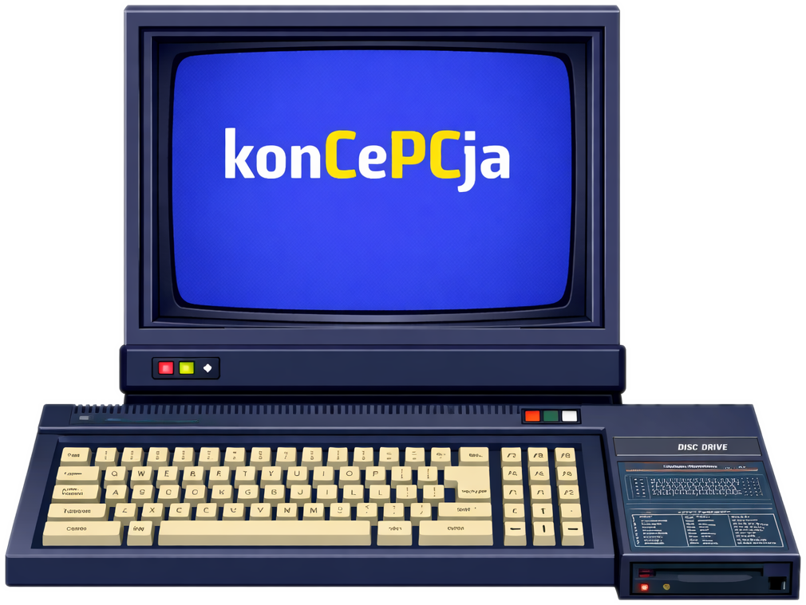

# konCePCja — Amstrad CPC Emulator

&copy; Copyright 1997–2015 Ulrich Doewich \
&copy; Copyright 2016–2025 Colin Pitrat \
&copy; 2026 Cezar "ikari" Pokorski

https://github.com/ikari-pl/konCePCja

  


## What is it?

konCePCja is a software emulator of the Amstrad CPC 8-bit home computer series, running on Linux, macOS and Windows. It faithfully imitates the CPC464, CPC664 and CPC6128 models, plus the CPC464+, CPC6128+ and GX4000 Plus Range machines. By recreating the operations of all hardware components at a low level, the emulator achieves a high degree of compatibility with original CPC software. Programs and games run unmodified at real-time or higher speeds, depending on the host environment.

konCePCja is designed as an **IPC-controllable debugging tool** — every feature is accessible via a TCP text protocol, making it scriptable by automation pipelines, CI systems and LLM agents. The 16-window Dear ImGui DevTools UI is built on top of the same API.

## Changes vs Caprice32

konCePCja is a fork of [Caprice32](https://github.com/ColinPitrat/caprice32) with a WinAPE-class debugger, full IPC automation and a modern Dear ImGui interface. 55K lines of source, 646 tests across 79 suites.

### Platform & UI
  * SDL3 migration + macOS menu integration
  * Dear ImGui overlay with 16 DevTools windows (see [DevTools](#devtools) below)
  * **Dockable workspace** — Classic (floating windows) or Docked mode with Debug, IDE and Hardware layout presets, plus custom save/load
  * **DevTools toolbar** — toggleable second topbar (F12) with dropdown menus and step/pause controls
  * PNG logo + macOS icns icon

### IPC Automation
  * **IPC protocol** — TCP server on port 6543 for remote control by scripts and LLM agents
  * **Headless mode** (`--headless`) — run without a window for CI and automation
  * **Input replay** — type text, press keys and control joysticks over IPC
  * **Auto-Type** — `autotype` command with WinAPE `~KEY~` syntax for scripted keyboard input
  * **Frame stepping** — advance exact frame counts for deterministic testing
  * **Exit control** — `--exit-after`, `--exit-on-break` and `quit` for scripted runs
  * **Hash commands** — CRC32 of VRAM, memory ranges and registers for CI assertions
  * **Event system** — fire IPC commands on PC match, memory write or VBL interval

### Debugger
  * **Breakpoints** with conditional expressions (`if A > #10 and peek(HL) = #C9`) and pass counts
  * **Watchpoints** — memory access breakpoints on read, write or both with address ranges
  * **IO breakpoints** — break on Z80 IN/OUT with port masks and conditions
  * **Step over / step out / step to** — function-level stepping, not just single instructions
  * **Expression parser** — WinAPE-compatible syntax with registers, `peek()`, `ay()`, `crtc()`, bitwise operators
  * **Debug timers** — measure T-state durations between code points via expression side-effects
  * **Symbol table** — load/save `.sym` files, bidirectional lookup, symbols in disassembly output
  * **Memory search** — find hex patterns (`??` wildcards), ASCII text, or Z80 mnemonics (`ld (*),hl`)
  * **Call stack** — heuristic stack walk with CALL/RST detection and symbol labels
  * **Data areas** — mark address ranges as bytes/words/text for correct disassembly output
  * **Disassembly export** — export address ranges to source files with optional symbol labels
  * **Instruction trace** — ring-buffer Z80 execution trace with dump to file
  * **Memory bank viewer** — read through Z80 banking, write path, or raw physical banks

### Disc & Media Tools
  * **Disc file editor** — `disk ls/get/put/rm` for AMSDOS files on DSK images
  * **Sector editor** — read/write individual sectors by track/side/sector ID
  * **Disc formatting** — create blank discs in standard CPC, IBM, and custom formats
  * **WAV recording** — capture audio output to WAV files
  * **YM recording** — capture PSG register writes to YM chiptune files
  * **AVI recording** — capture video+audio to AVI files
  * **Frame dumps** — save sequential PNG screenshots or animated GIFs with LZW compression

### Hardware & Plus Range
  * **Full Plus Range** — CPC464+/CPC6128+/GX4000 with ASIC hardware sprites, enhanced palette, DMA sound channels, and vectored interrupts
  * **CRTC type selection** — types 0, 1, 2 and 3 with per-type register behaviour
  * **4MB RAM expansion** (Yarek-compatible) — configurable up to 4096 KB
  * **Silicon Disc** — 256 KB battery-backed RAM disc in banks 4-7
  * **32 ROM slots** — load/unload/query ROM images
  * **ASIC register viewer** — sprites, DMA channels, palette, interrupts
  * **Video / Audio state** — live CRTC, Gate Array, PSG register viewers

### Session & Graphics
  * **Session recording** — record and replay full emulator input/state sessions
  * **Graphics finder** — decode CPC Mode 0/1/2 pixel data at any address with zoom and paint
  * **Pokes system** — load, apply and manage game cheats in .pok format
  * **Configuration profiles** — save and switch between named config presets

See [docs/ipc-protocol.md](docs/ipc-protocol.md) for the full IPC command reference (80+ commands).

## Features

  * Complete emulation of CPC464, CPC664 and CPC6128
  * Plus Range support: CPC464+/CPC6128+/GX4000 with ASIC sprites, DMA, enhanced palette, and vectored interrupts
  * CRTC types 0-3 with per-type behaviour
  * Joystick support — fully usable with joystick only, thanks to an integrated virtual keyboard
  * Joystick emulation — joystick-only games can be played using the keyboard
  * English, French or Spanish keyboards
  * DSK, [IPF](http://softpres.org/glossary:ipf) and CT-RAW files for disks — VOC and CDT files for tapes — CPR files for cartridges
  * Snapshots (SNA files)
  * Direct load of ZIP files
  * 16-window ImGui DevTools: registers, disassembly, memory hex, stack, breakpoints, symbols, data areas, graphics finder, session recording, silicon disc, ASIC viewer, disc tools, disasm export, video state, audio state, recording controls
  * Dockable workspace with Debug/IDE/Hardware presets and custom layout save/load
  * Disc file editor, sector editor and formatting (IPC and GUI)
  * WAV, YM and AVI recording
  * Custom disk formats
  * Printer support
  * Experimental Multiface 2 support (prefer the memory tool where possible)
  * 646 unit tests across 79 test suites

Something missing? Open an issue to suggest it.

## DevTools

Press **F12** or send `devtools` via IPC to toggle the DevTools toolbar below the main topbar. The toolbar provides dropdown menus (CPU, Memory, Hardware, Media, Export) and step/pause controls. All 16 windows are also accessible from the command palette:

| Window | Description |
|--------|-------------|
| **Registers** | Z80 registers and flags, editable in-place |
| **Disassembly** | Live disassembly with follow-PC, goto address, symbol labels and data area formatting |
| **Memory Hex** | Hex editor with configurable bytes-per-row and goto address |
| **Stack** | Stack view with heuristic CALL/RST detection and symbol names |
| **Breakpoints** | Unified table of breakpoints, watchpoints and IO breakpoints with add/delete forms |
| **Symbols** | Symbol table with filter, add/delete, load/save `.sym` files |
| **Data Areas** | Mark memory ranges as bytes/words/text for correct disassembly |
| **Disasm Export** | Export disassembly to source files with address range and symbol options |
| **Session Recording** | Record, stop and replay emulator sessions with progress display |
| **Recording Controls** | Transport controls for session playback with progress bar |
| **Graphics Finder** | Decode CPC pixel data at any address in Mode 0/1/2, with zoom, palette selector and paint |
| **Silicon Disc** | Enable/disable, bank usage display, clear/save/load the 256K RAM disc |
| **ASIC Viewer** | Plus Range hardware: 16 sprites, 3 DMA channels, 32-colour palette, interrupt state |
| **Disc Tools** | Drive selector, disc formatting, AMSDOS file browser, sector-level read |
| **Video State** | Live CRTC and Gate Array register display |
| **Audio State** | Live PSG (AY-3-8912) register display |

In **Docked mode**, windows snap into a tiled layout. Three presets are available (Debug, IDE, Hardware) and custom layouts can be saved/loaded from the Layout menu.

## Installation

### macOS

See [INSTALL.md](INSTALL.md).

### Linux

#### From Git

```
git clone --recurse-submodules https://github.com/ikari-pl/konCePCja.git
cd konCePCja
make APP_PATH="$PWD"
./koncepcja
```

> **Note:** A plain `make` without `APP_PATH` produces a debug-oriented build that looks for `koncepcja.cfg` in the current working directory, not next to the executable. Set `APP_PATH` to get the documented behaviour.

#### From releases

Download a release from https://github.com/ikari-pl/konCePCja/releases, decompress it and run:

```
./koncepcja
```

### Windows

Download a release from https://github.com/ikari-pl/konCePCja/releases, decompress it and double-click `koncepcja.exe`.

## Usage

See the [manual page](https://htmlpreview.github.io/?https://github.com/ikari-pl/konCePCja/blob/master/doc/man.html) for details. If you are lost, launch the emulator without arguments and press **F1** for the in-emulator menu.

## Building

See [INSTALL.md](INSTALL.md) for build instructions.

## License

The source for konCePCja is distributed under the terms of the GNU General Public License version 2 (GPLv2), included in this archive as `COPYING.txt`.

The screen-capture code uses [driedfruit SDL_SavePNG](https://github.com/driedfruit/SDL_SavePNG), released under the zlib/libpng license (compatible with GPLv2).

The bundled ROM images in `rom/` are &copy; Amstrad plc and Locomotive Software Ltd, redistributed with permission.
Amstrad have kindly given their permission for the redistribution of their copyrighted material but retain that copyright.
See [`rom/ROM-LICENSE.txt`](rom/ROM-LICENSE.txt) for full details including the Multiface II ROM.

## Contributing

Bug reports, feature suggestions and pull requests are welcome — just open an issue or submit a PR.
