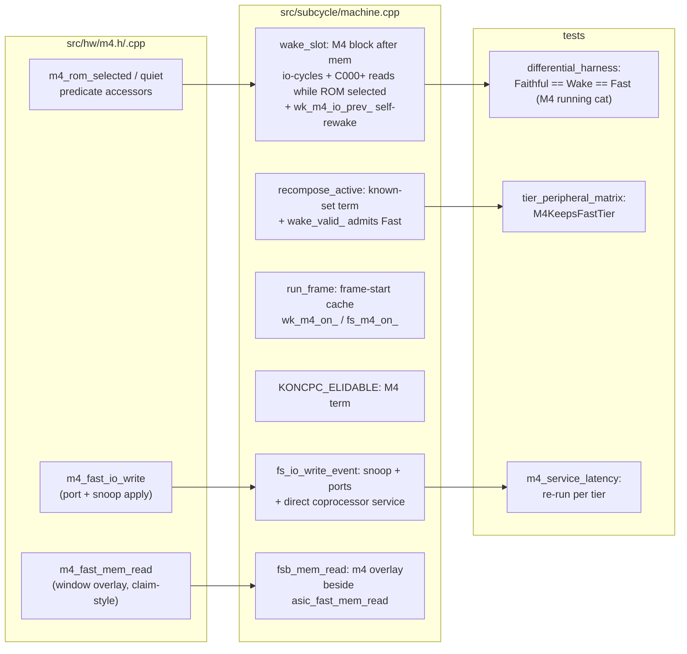
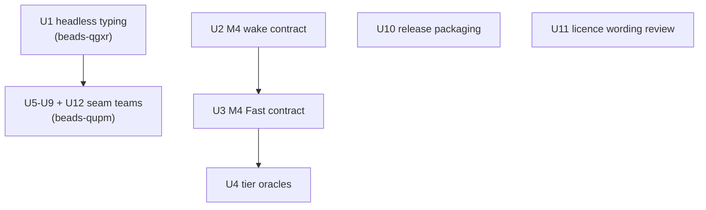

# fix: Sweep the open threads

## Summary

Close everything left open after the M4 saga: root-cause and fix headless
typing (beads-qgxr, P1), give the six untested bridge seams deep per-seam
test coverage via subagent teams (beads-qupm, P2), give the M4 a full wake +
Fast contract so it stops forcing Faithful (beads-tnlb), ship the real
licence in releases instead of stock GPLv2 (beads-7hcq, P1), and land the
manual licence corrections after user review of the wording.

---

## Problem Frame

Four beads and one uncommitted change remain from the 2026-08-02/03 sessions:

- **beads-qgxr** — keys on matrix rows 1–15 never reach the firmware in
  headless runs; row 0 works in the same session. The evidence chain (in the
  bead) verified every link healthy up to the PSG serving the correct byte on
  the per-cycle AY bus; the break is in what the Z80's actual IN sampling
  sees. The harness e2e `test_m4_cat_lists_the_sd_card` is deliberately red
  on this bug.
- **beads-qupm** — the bridge seam layer (`src/subcycle_bridge.cpp`) has zero
  test coverage; all three M4 wiring bugs lived there, invisible to 100+
  per-component tests.
- **beads-tnlb** — a plugged M4 is outside `recompose_active()`'s known set,
  so every M4 session silently runs Faithful (the plotter-class perf trap,
  ~3× slower than Wake). User decision: build the **full wake contract**, not
  a minimum-correctness stopgap.
- **beads-7hcq** — all three release targets copy stock-GPLv2 `COPYING.txt`
  (`makefile:488,504,516`) and none ships `LICENSE.md`, the actual
  konCePCja Source License 1.0.0.
- `manual/chapters/front_matter.typ` + `manual/web/index.html` carry
  uncommitted GPLv2→Source-License corrections; the user wants to review the
  wording before they land.

---

## Requirements

- **R1** — Typed input reaches the firmware in headless runs on all matrix
  rows. Definition of done: `test_m4_cat_lists_the_sd_card` passes, a
  5/5 statistical keydown probe passes, and a deterministic machine-level
  regression test pins the row-select path. This holds even if the root
  cause proves dummy-driver-specific.
- **R2** — Each of the six bridge seams (peripheral flags, symbiface,
  smartwatch, AMX mouse, serial backend, and the M4 command seam
  `sync_m4_command`) has deep, dedicated test coverage: machine-level
  protocol tests plus bridge-surface tests, one subagent team per seam. The
  M4 seam is the one all three historical wiring bugs lived in; the U2/U3
  oracles inject replies via `Machine::m4_respond()` directly and never
  cross the bridge, so it needs its own fail-proven bridge-surface test like
  the other five.
- **R3** — An M4-plugged machine runs Wake and Fast byte-identically to
  Faithful, proven by differential oracles; `effective_run_tier()` reports
  Fast with an M4 fitted; coprocessor service latency stays sub-frame in
  every tier.
- **R4** — Release archives ship `LICENSE.md` (and `NOTICE.md`), not
  `COPYING.txt`; a drift guard keeps it that way.
- **R5** — The manual licence corrections land only after the user approves
  the wording.

---

## Key Technical Decisions

- **M4 contract follows the canonical shape** established by the serial-pair
  (`1920bce6`, `6d68fbe1`, `dd099d7c`) and light-gun (`7d9ff86c`) commits:
  device-side predicate → `wake_slot` dispatch block → known-set entry +
  frame-start cache → Fast hooks → doc section → differential oracles. Do
  **not** renumber the M4's build index (16); extend the `known` disjunction
  with an identity term, as the serial pair did (`machine.cpp:1570`).
- **No `m4_advance()`**: the M4 carries no free-running counters or
  timestamps (`src/hw/m4.cpp` state audit), so like the serial pair it needs
  no frame-boundary catch-up — quiet/edge predicates only.
- **The wake predicate must be a *contiguous* superset over held strobes.**
  The M4's `io_prev` edge detector makes the tick idempotent under a held
  strobe only if the M4 sees every cycle from the strobe's first waking
  onward; waking it on the first cycle of an OUT and then sleeping until the
  strobe ends leaves `io_prev` stuck (the exact "only the first OUT of a
  burst registers" bug the serial pair hit). A `wk_m4_io_prev_` self-rewake
  mirrors `wk_serial_io_prev_`.
- **`romdis` is never held** (`wake_slot` starts every cycle from
  `bus_resting()`), so the M4 must be awake for at least the final cycle of
  every `mreq && rd` strobe in `0xC000–0xFFFF` while its ROM is selected —
  the safe superset is every such read cycle, gated on a cause-only
  rom-selected shadow. The M4 dispatch block lands **after** mem's (matching
  `tick_soldered` order) so its overlay drive wins the commit.
- **Fast tier answers the mailbox from the I/O event, not via bail.** Two
  viable shapes existed: (i) `fs_bail_` on the `&FCxx` execute write (serial
  precedent — costs the rest of the frame), or (ii) fire the coprocessor
  service directly from `fs_io_write_event`, so the response window is
  complete before the OUT retires and the batch stays engaged. Choose (ii);
  it is hardware-honest (the real STM32 answers in µs) and keeps Fast fast.
  Keep (i) documented as the fallback if the differential oracles diverge.
- **Fast reads use the ASIC-overlay precedent**: `fsb_mem_read`
  (`machine.cpp:1266`) already has exactly one claim-style overlay hook
  (`asic_fast_mem_read`); a sibling `m4_fast_mem_read` serves the response
  window, config window and busy sentinel. The ROM body itself already works
  in Fast (the bridge attaches the prepared image into the mem device's ROM
  slot).
- **Seam tests follow the `m4_service_latency_test.cpp` pattern** — a real
  `Machine`, a Z80 program speaking the device's own protocol, asserting the
  CPC-visible result — plus host-surface tests through the public
  `subcycle_bridge_*` API with the host globals set. Lifting the sync
  functions out of the anonymous namespace is allowed where the public
  surface cannot reach them (the `imgui_ui_testable.h` precedent).
- **qgxr is investigation-first.** The bead's evidence chain ends at a
  verified-correct per-cycle AY bus serve with zero firmware effect, and a
  row-0-vs-row-8 asymmetry. The plan pins the investigation order (below)
  instead of guessing a fix.
- **Deterministic oracles use architectural state only** (regs + RAM +
  framebuffer), never `save_devices()` — the RTC devices embed host
  wall-clock (the `irq_banking_invariants_test.cpp` pattern).

---

## High-Level Technical Design

### The M4 contract's touch points

### Unit dependencies

U1 unblocks any seam test that types through the firmware; the seam teams
are otherwise independent of each other and suited to parallel subagent
dispatch with worktree isolation. U10 and U11 are independent of everything.

---

## Implementation Units

### U1. Root-cause and fix headless typing (beads-qgxr)

**Goal:** Keys on all matrix rows reach the firmware in headless runs; the
red e2e turns green.

**Requirements:** R1

**Dependencies:** none — do this first; U5–U9 partially depend on it.

**Files:** suspects only, refined by investigation — `src/subcycle/machine.cpp`
(fast/wake keyboard read paths), `src/hw/ppi.cpp` (`ppi_fast_lines`,
row-select), `src/hw/psg.cpp` (`psg_fast_read`); tests in
`test/hw/keyboard_row_select_test.cpp` (new), `test/integrated/ipc_harness.py`
(existing red e2e).

**Approach:** Follow the bead's pinned investigation order rather than
re-treading verified links:
1. Verify tier pinning actually happened in the earlier probes — read the
   `tier` IPC response in a failing run before trusting "fails on Faithful
   too".
2. The verified per-cycle serve (`ay_read_value` row8→DF) may not be the
   value the Z80's IN samples. Trace the actual PPI port-A read per tier:
   Fast goes through `fs_io_read_event` → `ppi_fast_io_read(..., ay_da)`
   with `ay_da = psg_fast_read(&sdev_, lines.kbd_row, 0xFF)` — check whether
   `ppi_fast_lines` returns a stale `kbd_row` (initial 0 explains row 0
   working and rows 1–15 dead).
3. If the wake/per-cycle paths are also implicated, apply the same
   stale-select question to their PPI row-select propagation.

**Execution note:** characterization-first — with the evidence obligations
split honestly: the red e2e `test_m4_cat_lists_the_sd_card` is the pre-fix
characterization artifact (it fails today); the deterministic row-scan test
satisfies the fail-proven rule via fault injection of the root-cause link
once identified (it cannot be assumed to fail pre-fix — it injects at the
device, and the bead already verified the machine-side chain healthy); and
if the root cause proves host-side (dummy-driver events, the matrix mirror,
scan gating), one additional regression test at that host link is the
pinning test, not the machine-level one.

**Test scenarios:**
- New machine-level test (no firmware needed): a Z80 program selects each
  matrix row 0–15 via the PPI, reads PSG port A, and stores the result;
  assert each row reads its own injected `set_key_row` pattern (the matrix
  array is 16 wide; R1 says all rows, so test all sixteen). Run under
  Faithful, Wake, and Fast. Fail-proven by fault-injecting the
  identified broken link; covers the row-0-vs-row-8 asymmetry exactly.
- Existing e2e `test_m4_cat_lists_the_sd_card` passes (types `cat`, asserts
  the listing).
- Statistical probe: 5/5 headless keydown runs echo the held key (script the
  probe from the bead into the harness or a scripts/ helper, judgement call
  at implementation time).

**Verification:** e2e green in the harness; new test fails on the pre-fix
tree and passes after; `bd close beads-qgxr`.

---

### U2. M4 wake contract (beads-tnlb, part 1)

**Goal:** A plugged M4 keeps the Wake tier valid and byte-identical to
Faithful.

**Requirements:** R3

**Dependencies:** none (parallel with U1).

**Files:** `src/hw/m4.h`, `src/hw/m4.cpp` (predicate accessors: rom-selected
shadow source, any quiet notion), `src/subcycle/machine.h` (`wk_m4_on_`,
`wk_m4_io_prev_`, rom-selected shadow field), `src/subcycle/machine.cpp`
(wake_slot dispatch block after mem, known-set term at `recompose_active`,
frame-start cache in `run_frame`, `KONCPC_ELIDABLE` term, the loop-top
mailbox check's now-stale comment at `machine.cpp:1684-1690`),
`docs/hardware/m4-device.md` (new "Batch contracts (Wake / Fast)" section —
template: `docs/hardware/light-gun-device.md`), tests in
`test/hw/differential_harness_test.cpp`.

**Approach:** Per the Key Technical Decisions: wake the M4 on every `iorq`
cycle, every `mreq && rd` cycle at `0xC000+` while the rom-selected shadow
says its ROM is paged, one self-rewake cycle after any owned I/O
(`wk_m4_io_prev_`), and on `forced`. The shadow updates cause-only (on
`iorq && wr` cycles the M4 was awake for, plus frame-start force). The
`KONCPC_ELIDABLE` term is `!wk_m4_io_prev_`, mirroring the serial pair's
`!wk_serial_io_prev_` (`machine.cpp:879`) — without it, elision can skip
the slot pair carrying the self-rewake and leave `io_prev` stuck exactly as
the contiguity rule forbids; no further M4 term is needed because the macro
already excludes `iorq` cycles and held `0xC000+` read strobes keep mem
awake. Wake-tier service delivery must also be pinned: a latched command
(mailbox waiting / busy) counts as NON-quiet for both the elision term and
any chunk-quiet notion, so an execute write ends the current elided span
and the existing loop-top mailbox check (`machine.cpp:1689`) fires the
service within a microsecond — that check's comment currently justifies
its coverage with "an M4-plugged board runs per-cycle (no wake contract)",
a premise this unit deletes; update the comment with the contract, and
both service paths (loop-top and the Fast direct fire) must stay no-op on
an empty mailbox so a command is never serviced twice. Mind the mid-frame
host mutation: the coprocessor service clears `busy` from outside the
tick, so any cached quiet notion must be re-read after a service fire —
prefer keying the predicate on live device state via a pointer accessor
(the `m4_command_waiting` precedent).

**Patterns to follow:** the serial-pair block at `machine.cpp:729-753`
(unit-ticked, self-rewake, quiet snapshot); the bestiary at
`machine.cpp:441-493`; `docs/plans/2026-07-09-001-feat-runtier-fast-plan.md:247`.

**Test scenarios:**
- Differential oracle: `FaithfulMatchesWakeTier_M4` — build with M4 plugged
  + ROM attached + a host service that answers READDIR-style commands with
  fixed payloads; run the `m4_service_latency` Z80 program (or a longer
  command-burst variant) for N frames under Faithful and Wake; assert
  arch-hash equality per frame (regs + RAM + framebuffer, never
  `save_devices`).
- Command-burst edge: a program issuing two back-to-back OUT bursts to
  `&FE00` must accumulate every byte under Wake (the `io_prev` stuck-edge
  trap) — assert the delivered frame lengths match Faithful.
- Response-window read while ROM selected: the LDIR copy under Wake returns
  the same bytes as Faithful (the romdis strobe-tail coverage).
- Elision alignment: a workload of command burst → ≥2 elidable quiet slot
  pairs → command burst stays byte-identical to Faithful (exercises the
  `!wk_m4_io_prev_` elision term; a continuously-busy workload never
  enters elision and would pass vacuously).
- `wake_active()` is true with the M4 plugged (the gate actually admitted
  it).

**Verification:** differential oracle green across ≥100 frames; existing
1638-test suite green; interleaved A/B FPS sanity check on a 6128+M4 boot
(expect Wake-class, not Faithful-class, numbers — thermals swing ±15%, only
interleaved readings count).

---

### U3. M4 Fast contract (beads-tnlb, part 2)

**Goal:** The Fast batch delivers M4 I/O, serves its read overlays, and
answers the mailbox at coprocessor latency — no silent command drops.

**Requirements:** R3

**Dependencies:** U2 (admitting the M4 to `wake_valid_` auto-admits it to
`fast_valid_` at `machine.cpp:1587`, so U2 must not land without this or the
Fast batch silently drops M4 commands).

**Files:** `src/hw/m4.h`, `src/hw/m4.cpp` (`m4_fast_io_write` port+snoop
apply, `m4_fast_mem_read` claim-style overlay), `src/subcycle/machine.h`
(`fs_m4_on_` cache), `src/subcycle/machine.cpp` (`fs_io_write_event` M4
block incl. direct service fire, `fsb_mem_read` overlay hook, `run_frame_fast`
entry cache, `fast_pending` gate only if a residual unbatchable state is
found).

**Approach:** Snoop hook beside the named snoopers (`machine.cpp:1156-1162`);
port writes via the double-tick pattern (FDC/printer at
`machine.cpp:1127-1145`) or a direct fast-apply entry — implementer's call;
after applying an `&FCxx` execute write, fire the coprocessor service
directly (decision above) so the overlay serves the completed response on
the very next batched read. `m4_fast_mem_read` mirrors the tick overlay:
busy sentinel across the whole window, response bytes under `response_len`,
config window, else no claim.

**Test scenarios:**
- `m4_service_latency_test` re-run with the machine pinned to Fast (and
  Wake): the same-frame reply assertion catches any latency regression per
  tier.
- Three-way differential: Faithful vs Wake vs Fast arch-hash over the
  command workload (extends U2's oracle; the light-gun
  `TierLatchAgreesSolderedWakeFast` is the naming template).
- Batch overlay correctness: with a response completed, batched reads of
  `&E800..` return response bytes while reads past `response_len` return
  ROM body — asserted by comparing against the Faithful run byte-for-byte.
- A command issued mid-batched-frame is answered without the frame bailing
  (assert `fast_frames_run_` still advances — Fast stayed engaged).

**Verification:** all three tiers byte-identical on the M4 workload; a GUI
smoke run with the M4 enabled shows `tier` reporting `effective=fast` and
`cat` still rendering correctly.

---

### U4. Tier matrix + doc closure for the M4 contract

**Goal:** Pin the new contract in the standing test matrix and docs; close
beads-tnlb.

**Requirements:** R3

**Dependencies:** U2, U3.

**Files:** `test/hw/tier_peripheral_matrix_test.cpp`,
`docs/hardware/m4-device.md`, `AGENTS.md` (the run_tier note that lists
which peripherals degrade the tier, if present).

**Approach:** Add `M4KeepsFastTier` (mirror `LightGunKeepsFastTier` at line
39, incl. `set_m4_slot` + `attach_m4_rom` so the ROM-selected path is
exercised); update the file header comment (it currently says plugged
expansions without contracts degrade — still true, the M4 just moves lists);
write the "Batch contracts (Wake / Fast)" section in the device doc,
including the io_prev contiguity rule and the romdis strobe-tail rule.

**Test scenarios:**
- `M4KeepsFastTier`: boot Fast, plug M4 with ROM, one frame →
  `effective_run_tier() == Fast`; five more frames → still Fast.
- Symbiface/MF2 degradation tests stay green (the known-set widening must
  not over-admit).

**Verification:** `bd close beads-tnlb`; suite green.

---

### U5–U9, U12. Bridge seam deep-dive teams (beads-qupm)

One unit per seam, each sized for a dedicated subagent team (worktree
isolation; each prompt must carry the MINGW cross-compilation constraints
and the serialize-test_runner rule; land by ff/cherry-pick per the
worktree-base trap). Shared shape for every seam unit:

- **Machine-level protocol tests** (the `m4_service_latency_test.cpp`
  pattern): a real `Machine`, a Z80 program speaking the device's protocol,
  asserting CPC-visible results.
- **Bridge-surface tests**: drive the public `subcycle_bridge_*` API with
  the host globals set (`CPC`, `g_symbiface`, `g_smartwatch`, `g_amx_mouse`,
  `g_serial_interface`); lift seams to a named namespace only where the
  public surface cannot reach them.
- Each new test must be **proven to fail** against a deliberately broken
  seam (comment out the sync call locally) before it counts.

**U5. `sync_peripheral_flags`** — Files: `test/bridge_peripheral_flags_test.cpp`
(new). Scenarios: each `CPC.*` enable toggle plugs/unplugs its Device
(digiblaster, printer-ready strap, and every `set_*` the seam mirrors);
printer capture drains strobe-clocked bytes to the host file; the
M4-class bug shape — "fitted everywhere except the machine" — asserted per
peripheral by peeking Device plugged state after a frame.

**U6. `sync_symbiface`** — Files: `test/bridge_symbiface_test.cpp` (new).
Scenarios: DS12887 registers carry BCD host time (inject a fixed tm via a
seam-level time source or assert BCD shape + monotonicity — implementer
picks, noting the RTC nondeterminism rule); PS/2 FIFO drains
packet-for-packet in order; FIFO wraparound; a Z80 program reading the RTC
through ports `&FD14/&FD15` sees plausible BCD.

**U7. `sync_smartwatch`** — Files: `test/bridge_smartwatch_test.cpp` (new).
Scenarios: the 8-byte DS1216 time block reaches the Device; a Z80 program
executing the 64-bit recognition pattern then clocking out 64 bits gets
BCD time with the 0x80 hour flag — the full phantom-RTC protocol
end-to-end.

**U8. `sync_amx_mouse`** — Files: `test/bridge_amx_test.cpp` (new).
Scenarios: host mickeys accumulate and hand off with read-and-zero
semantics (no double-count across frames); a Z80 program
deselect/reselecting row 9 sees one direction pulse per mickey (the
monostable contract); button state reaches row 9 bits; negative deltas.

**U9. `sync_serial_backend`** — Files: `test/bridge_serial_backend_test.cpp`
(new). Scenarios: backend RX bytes reach `serial_host_rx` in order; the
plotter backend type is excluded (guard clause); no-backend and disabled
configs move nothing; a burst larger than one frame's worth arrives intact
across frames.

**U12. `sync_m4_command`** — Files: `test/bridge_m4_command_test.cpp` (new).
Scenarios: with `g_m4board`/bridge host globals set, a command latched in
the Device reaches `m4board_execute()` through the bridge and the response
reaches the Device via `m4_respond`/`m4_config`; the config buffer crosses
too; a disabled `g_m4board.enabled` moves nothing; proven to fail with the
`sync_m4_command` call commented out. This is the seam the three historical
M4 bugs lived in — the U2/U3 oracles bypass it by construction.

**Requirements:** R2. **Dependencies:** U1 for any scenario that types
through the firmware (most scenarios above avoid it deliberately).

**Verification:** every new test fail-proven; suite + harness green on
macOS; MINGW CI green; `bd close beads-qupm`.

---

### U10. Ship the real licence in releases (beads-7hcq)

**Goal:** No release artifact claims GPLv2.

**Requirements:** R4

**Dependencies:** none.

**Files:** `makefile` (lines 488, 504, 516; line 489 copies `licenses/`;
the source target copies `debian/` wholesale), `test/release_packaging_test.cpp`
(new, archive-content guard), `debian/` (Caprice32's 2016 packaging
metadata — `debian/copyright` declares `Upstream-Name: caprice32`,
`Files: * → GPL-2.0+`), `licenses/wGui License.txt` (licence for code that
no longer exists in the tree), plus the fate of `COPYING.txt` at repo root.

**Approach:** Replace `COPYING.txt` with `LICENSE.md NOTICE.md` in all three
package targets. Delete the fork residue: `COPYING.txt` at root, the entire
`debian/` directory (stale Caprice32 packaging that ships a GPL-2.0+ claim
for the whole tree inside our source packages), and
`licenses/wGui License.txt` (wGui was deleted with the v6 rewrite).
`licenses/Bitstream Vera License.txt` stays while `resources/vera_*.ttf`
ship — verify at implementation time whether the fonts are still loaded and
drop both together if not. All deletions are licensing statements, not
mechanical cleanup: fold them into the same user review gate as U11. Guard
with an archive-content test: build the package staging dirs and assert no
staged file declares GPL-2.0+ as the project licence, `LICENSE.md` and
`NOTICE.md` are present, and `COPYING.txt`/`debian/copyright` are absent —
a recipe-text grep alone is structurally blind to copied directories.

**Test scenarios:**
- Guard fails on the pre-fix makefile/staging (ships `COPYING.txt` and
  `debian/copyright`), passes after.
- Guard asserts all three targets (binary archive, cfg archive, source
  package) ship `LICENSE.md` and `NOTICE.md` and stage no file claiming
  GPL-2.0+ for the tree.

**Verification:** local `make` of one package target shows the right files
in the archive dir; `bd close beads-7hcq`.

---

### U11. Manual licence corrections — review, then land

**Goal:** The uncommitted GPLv2→Source-License corrections in
`manual/chapters/front_matter.typ` and `manual/web/index.html` land with
user-approved wording.

**Requirements:** R5

**Dependencies:** none. **Gate: user review of the wording before commit.**

**Approach:** Present both diffs to the user verbatim (already captured in
session), apply any wording edits they request, rebuild the manual/web page
to confirm no layout breakage, commit via PR (never direct to master).

**Test expectation:** none — documentation wording; the build check stands
in for tests.

**Verification:** user has explicitly approved or amended the wording; the
built page renders; PR merged.

---

## Scope Boundaries

- **In:** the four named beads, the manual licence corrections, and the
  regression tests that pin each fix.
- **Out:** beads-771z (the step-in flake — known, separately tracked);
  broader M4 command-set coverage (OPEN/READ/`run"file`) beyond what the
  tier oracles exercise; perf tuning beyond what the contract itself buys;
  the macOS QoS/E-core scheduling question from the plotter finding.

### Deferred to Follow-Up Work

- A wake contract for symbiface/smartwatch/MF2/AmDrum (they still degrade
  the tier; U5–U7's tests make future contracts safe to attempt).
- Harness-level statistical input probe as a permanent CI job (if U1's
  probe proves flaky-prone on CI runners, keep it local-only and file it).

---

## Risks & Dependencies

- **The wake contract is the risk centre.** Mitigations are built in: the
  contiguity rule for `io_prev`, the romdis strobe-tail rule, dispatch order
  after mem, and byte-identity oracles across ≥100 frames before any merge.
  If Wake diverges from Faithful and resists diagnosis, land U2 behind the
  existing degradation (contract dark, bead stays open) rather than shipping
  a divergent tier — cross-tier byte-identity is the project's hard
  invariant.
- **U3 must land with U2** (auto-admission to Fast via
  `fast_valid_ = wake_valid_`); landing U2 alone silently drops M4 commands
  under Fast. Sequencing inside one PR, or a temporary explicit
  `fast_valid_` veto for the M4, whichever the implementation finds cleaner.
- **qgxr root cause is unknown by design.** The unit budgets for
  investigation; if the cause lands outside the suspected row-select path,
  the deterministic row-scan test still stands as the acceptance gate.
- **Subagent teams inherit the known traps**: worktree branches base off
  master (reset-first in prompts), concurrent `test_runner` runs collide on
  M4 HTTP fixtures (serialize), MINGW needs the standard portability notes.

---

## Verification (plan-level)

1. Full suite green (≥1638 + new tests), harness 17/18 (771z excepted, cat
   e2e now green), `make clang-format` clean.
2. Three-way tier byte-identity on the M4 workload; `M4KeepsFastTier` green.
3. Every new test demonstrated failing against its broken state.
4. A release package built locally contains `LICENSE.md` + `NOTICE.md`, no
   `COPYING.txt`.
5. All four beads closed with reasons; manual PR merged after wording
   approval.
