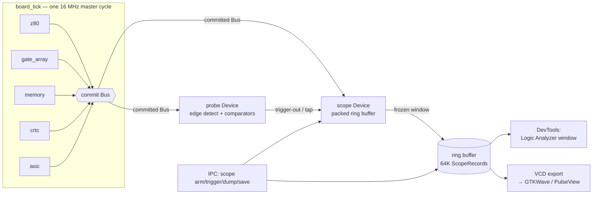

# The Logic-Analyzer View — a virtual scope on the CPC bus

> **Status:** design / vision. No code here — this proposes a representation and
> the capture path that feeds it. Grounded in `src/hw/buses.h` (the `Bus`),
> `src/hw/board.h` (the two-phase scheduler), `src/hw/device.h` (the Device
> contract), `src/hw/probe.*` (the ICE bus probe) and
> `docs/hardware/gate-array-device.md` (the phase grid + video-slot interleave).

## 1. Why a register table is the wrong instrument

Every classic CPC debugger — including our own DevTools Z80 pane — shows you
*state at rest*: `PC=A742 HL=BE80 A=3C`, a hex dump, a disassembly. That view is
a photograph taken at an instruction boundary. It throws away everything
konCePCja actually computes, because konCePCja is not sampling the machine once
per instruction — it is resolving **every pin, every 16 MHz master cycle, with
an explicit driver for each line**.

The truths that only exist *between* the register snapshots:

- **Who is driving the bus right now.** `CpuBus.data` resting at `0xFF` is a
  floating bus; the same `0xFF` driven by the ROM is a real byte. A register
  table cannot tell them apart. The two-phase commit can: exactly one device
  wrote that line this cycle.
- **Wait-states and µs quantisation.** The Gate Array holds the Z80 with WAIT
  for 3 of every 4 T-states so each bus M-cycle's T1 lands on a 1 µs boundary
  (`gate-array-device.md §3`). Those wait T-states are *invisible* to a
  register view — the PC just doesn't move for a while. On a scope they are the
  whole story.
- **The CPU-slot vs video-fetch interleave.** Within one 1 µs window the same
  RAM is read by the CPU (phases 0–11) and twice by the GA's video DMA (drive
  at phase 12 and 14). A register table has no column for "phase". A scope's
  x-axis *is* phase.
- **One-hop settle latency.** Signals propagate one master cycle per hop
  (`device.h`, spec §2). When an expansion asserts `romdis`, the memory Device
  doesn't see it until the *next* cycle. That one-cycle overlay-latch settle is
  a real hardware race the scope shows and a register table erases.
- **Exact sub-µs ordering of BUSRQ→BUSAK→drive.** DMA arbitration is a
  three-cycle handshake (ASIC asserts, CPU grants next cycle, ASIC drives the
  cycle after). Nowhere in a register dump does that ordering survive.

The instrument that matches this data is a **logic analyzer**: signal names down
the left, time (master cycles, gridded into the 0..15 phase window) across the
top, one high/low trace per pin, and value lanes for the address/data buses.

---

## 2. What we capture — the committed `Bus`, verbatim

The pin-level-truth bar forbids reconstructing signals from higher-level state.
We don't have to: the ground truth is already a plain struct. `board_tick`
commits one `Bus` value per master cycle (`board.h` — `Board.bus` is *the*
committed image, `Board.master_cycles` its timestamp). The scope records that
struct. Nothing is inferred.

```
struct Bus {                     what the scope plots
  CpuBus cpu;   addr data m1 mreq iorq rd wr rfsh halt wait irq nmi
                reset busrq busak romdis ramdis
  VidBus vid;   ma ra hsync vsync dispen cursor
  RamBus ram;   addr data fetch
  AyBus  ay;    da bdir bc1 kbd_row row_ext
  TapeBus tape; rdata motor wdata
  Clocks clk;   cpu crtc psg phase
}
```

### 2.1 The capture Device — a passive sibling of the probe

`src/hw/probe.*` is already the exact precedent: an **ICE-style Device that
drives nothing** (`(void)out; // infinite input impedance`), reads the committed
`in` every master cycle, and does edge detection across held/stretched cycles
(it keeps `prev_fetch/prev_mrd/...` precisely because "a Z80 access holds its
strobes across many master cycles"). The scope is the probe's twin: same
read-only contract, but instead of a single latch it writes a **ring buffer**.

```
struct ScopeRecord {          // 8 bytes packed — 512 KB buffers 64K cycles (~4 ms)
  uint16_t addr;              // cpu.addr (or ram.addr in a video slot)
  uint8_t  data;              // cpu.data / ram.data
  uint8_t  phase;            // clk.phase 0..15
  uint32_t ctl;              // bitfield: one bit per control line below
};
// ctl bit layout (active-high, matching buses.h):
//   m1 mreq iorq rd wr rfsh halt wait irq nmi reset busrq busak romdis ramdis
//   clk.cpu clk.crtc clk.psg  ram.fetch  vid.hsync vid.vsync vid.dispen cursor
//   ay.bdir ay.bc1  tape.motor ...
```

Two viable wiring points, both truthful:

1. **Scope Device** appended to the board like the probe. Its `tick` sees
   `in` = the bus committed *last* cycle (one-hop old but fully settled) and
   copies it into `ring[now % N]`. Consistent, self-contained, survives
   save/load through the Device `state_size/save/load` hooks.
2. **Host-side tap** right after `board_tick` returns, snapshotting `Board.bus`
   (this cycle's committed image, zero hops old) into the ring. Simplest; used
   when the scope must see the same cycle the host is stepping.

Recommended: the Device form for provenance parity with `probe`, host-tap as an
opt-in for lock-step stepping. Either way the record is a verbatim copy of a
committed bus — no signal is ever synthesized.

### 2.2 Triggering — reuse the probe's comparators

The probe already models a trigger system: exec/watch/I-O comparators that
latch `{kind, addr, data, cycle}`, plus **taps** it explicitly documents as "a
logic analyzer's trigger-out line". The scope subscribes to that trigger-out:

| Trigger | Built from | Example |
|---|---|---|
| exec at addr | `probe_add_exec` | freeze when PC fetches `0xA742` |
| mem read/write at addr | `probe_add_watch` | freeze on write to screen base `0xC000` |
| I/O port match | `probe_add_io` (value/mask) | freeze on OUT to GA `0x7Fxx` |
| **edge on any pin** | new: scope edge comparator | `busak` rising, `hsync` rising, `ram.fetch` rising, `wait` rising |
| IACK signature | `m1 && iorq` (never matches I/O comparators by design) | freeze on interrupt acknowledge |

Classic scope semantics: the ring records **continuously while armed**; on
trigger it captures `post_trigger` more cycles then freezes, so the buffer holds
a configurable **pre/post-trigger** split around the event. "Trigger on `busak`
rising, 512 cycles pre, 512 post" gives you the whole DMA handshake centred in
the window.

---

## 3. Reading the notation

Time runs left→right, **one column per 16 MHz master cycle**, 16 columns per
1 µs window labelled with `clk.phase`. Control lines use a continuous waveform
(`▔` asserted / active-high in our model, `▁` deasserted). Bus lanes
(`cpu.addr`, `cpu.data`, `ram.addr`, `ram.data`) show the value held that cycle;
`··` means floating/resting (`0xFF` pull-up).

The `clk.cpu` row is the ÷4 CPU enable — it pulses at phases **0,4,8,12**, i.e.
the four T-states of the µs. A memory M-cycle's T1 is quantised to phase 0 (§4b),
so read T1/T2/T3 land on phases **0/4/8** and the GA's two video fetches land on
**12/14** — the interleave is structural, not coincidental.

```
              1 µs window = 16 master cycles = 4 CPU T-states = 1 CRTC char
phase    │ 0  1  2  3  4  5  6  7  8  9 10 11 12 13 14 15│
         │T1        T2        T3        T4(refresh/idle) │
```

---

## 4. Worked traces

### 4a. A Z80 memory-read M-cycle (`MC::READ`, e.g. the read of `LD A,(HL)`)

Three T-states. The CPU drives `addr`+`mreq`+`rd` at T1 (phase 0) and holds them
across the idle master cycles (drive-and-hold, `z80.cpp` ~L2000: it re-asserts
the held lines but **tri-states `data` on a read** so the memory Device is the
sole driver). The memory Device answers `cpu.data` continuously; the CPU
**samples at T3** — reading `in->cpu.data`, which is the value committed the
previous cycle (one-hop latency, `z80.cpp:2146` "opcode sampled here").

```
phase     │ 0  1  2  3  4  5  6  7  8  9 10 11 12 13 14 15│
clk.cpu   │▔▔▁▁▁▁▁▁▔▔▁▁▁▁▁▁▔▔▁▁▁▁▁▁▔▔▁▁▁▁▁▁│  pulses @0,4,8,12
cpu.mreq  │▔▔▔▔▔▔▔▔▔▔▔▔▔▔▔▔▁▁▁▁▁▁▁▁▁▁▁▁▁▁▁▁│  T1..T2 held, drops @T3
cpu.rd    │▔▔▔▔▔▔▔▔▔▔▔▔▔▔▔▔▁▁▁▁▁▁▁▁▁▁▁▁▁▁▁▁│
cpu.m1    │▁▁▁▁▁▁▁▁▁▁▁▁▁▁▁▁▁▁▁▁▁▁▁▁▁▁▁▁▁▁▁▁│  (not an opcode fetch)
cpu.addr  │ BE80 ───────────────────────── │  = HL, stable T1..T3
cpu.data  │ ·· ·· ·· 3C 3C 3C 3C 3C 3C↑·· ··│  mem drives; CPU latches ↑@phase8
ram.fetch │▁▁▁▁▁▁▁▁▁▁▁▁▁▁▁▁▁▁▁▁▁▁▁▁▔▔▁▁▔▔▁▁│  GA video slots @12,14
ram.addr  │ ···················· V0 V0 V1 V1│
ram.data  │ ································dd│  RAM answers one hop later
```

What the scope reveals here that a register table cannot: `cpu.data` is
*floating* (`··`) until the memory Device asserts it, the byte `3C` is valid for
several cycles before the CPU actually latches it at phase 8, and the CPU's read
strobes have fully released by phase 11 — which is *why* the GA's video fetch at
phase 12/14 never contends. "Contention-free by construction" (`§2b/§3` of the
GA doc) stops being a claim and becomes a picture.

### 4b. The CPU slot vs GA video-fetch interleave in one 1 µs window

This is the trace that only a phase-gridded scope can draw. The µs splits into a
CPU slot (phases 0–11, the mux passes the CPU address) and two video fetches
(the GA drives `ram.addr`+`ram.fetch` at phase 12 and 14 — a page-mode pair
differing only in A0). RAM answers one hop later; the `video` Device latches
`fetch0` at **phase 13** and byte 1 at **phase 15**, then paints the cell
(`video.cpp:332` `if (phase==13) fetch0 = ram.data; if (phase==15) {...paint}`).

```
phase     │ 0  1  2  3  4  5  6  7  8  9 10 11 12 13 14 15│
          │◀────────── CPU slot ──────────▶◀ video slots ▶│
clk.crtc  │▔▔▁▁▁▁▁▁▁▁▁▁▁▁▁▁▁▁▁▁▁▁▁▁▁▁▁▁▁▁▁▁│  CRTC advances 1 char @phase0
cpu.mreq  │▔▔▔▔▔▔▔▔▔▔▔▔▔▔▔▔▁▁▁▁▁▁▁▁▁▁▁▁▁▁▁▁│  CPU read completes by ph11
cpu.addr  │ 8000 ───────────────────────── │
ram.fetch │▁▁▁▁▁▁▁▁▁▁▁▁▁▁▁▁▁▁▁▁▁▁▁▁▔▔▁▁▔▔▁▁│  fetch k=0 @12, k=1 @14
ram.addr  │ ·····················  MA:RA:0  MA:RA:1 │
ram.data  │ ······················ ·· b0 ·· b1│  byte0@13, byte1@15
vid.ma    │ 0142 ───────────────────────── │  CRTC MA0..13 (this char)
vid.ra    │ 03 ─────────────────────────── │  row-address within char
vid.dispen│▔▔▔▔▔▔▔▔▔▔▔▔▔▔▔▔▔▔▔▔▔▔▔▔▔▔▔▔▔▔▔▔│  active display (not border)
          │                          ▲latch b0     ▲latch b1 + paint cell
```

Note the two buses are physically distinct: `CpuBus.addr=8000` (the CPU's read)
and `RamBus.addr=MA:RA` (the GA's fetch) coexist in the same µs on *different*
wires — exactly why the CPC has no Spectrum-style contended memory. The scope
puts both address lanes on screen simultaneously; a single "address" field in a
register view could only ever show one of them.

### 4c. Interrupt acknowledge with the IM2 vector (`MC::IOACK`)

The GA fires `cpu.irq` at `sl_count==52` and holds it until the Z80
acknowledges. Acceptance happens only at an instruction boundary with `IFF1`
set (`z80.cpp:2022`, `int_ready`). The acknowledge M-cycle is the Z80's unique
**`m1 && iorq` together** signature (`z80.cpp:2265`) — the one place both assert
at once, which is why the probe's I/O comparators deliberately never match it.
On the CPC no device drives a vector, so `cpu.data` floats `0xFF`; `int_vec`
latches `0xFF`; IM2 then vectors through `(I<<8 | 0xFF)`, reading the two
pointer bytes and jumping there.

```
                 ┌─ interrupt-acknowledge M-cycle ─┐┌─ IM2 vector fetch ─┐
phase     │ ...0 .. 4 .. 8 ..12│ 0 .. 4 .. 8 ..12│ 0 ....           │
cpu.irq   │▔▔▔▔▔▔▔▔▔▔▔▔▔▔▔▔▔▔▔▔▁▁▁▁▁▁▁▁▁▁▁▁▁▁▁▁│  GA drops it on ack
cpu.m1    │▔▔▔▔▔▔▔▔▔▔▔▔▔▔▔▔▔▔▔▔▁▁▁▁▁▁▁▁▁▁▁▁▁▁▁▁│  ┐ both high ⇒
cpu.iorq  │▔▔▔▔▔▔▔▔▔▔▔▔▔▔▔▔▔▔▔▔▁▁▁▁▁▁▁▁▁▁▁▁▁▁▁▁│  ┘ IACK signature
cpu.mreq  │▁▁▁▁▁▁▁▁▁▁▁▁▁▁▁▁▁▁▁▁▔▔▔▔▔▔▔▔▔▔▔▔▁▁▁▁│  then real vector reads
cpu.rd    │▁▁▁▁▁▁▁▁▁▁▁▁▁▁▁▁▁▁▁▁▔▔▔▔▔▔▔▔▔▔▔▔▁▁▁▁│
cpu.addr  │ PC (pushed next) ──│ I:FF ───────── │  vector table ptr = I<<8|FF
cpu.data  │ ·· ·· ·· FF(float) │ lo ·· hi ·· ── │  no device drives vector
```

The scope makes the classic CPC interrupt subtlety legible: the GA's
`sl_count &= 0x1F` (clear bit 5) happens *on this ack edge* — trigger the scope
on the `m1&&iorq` signature and you can watch `cpu.irq` fall exactly one handoff
later, confirming the acknowledge wiring end-to-end.

### 4d. A DMA cycle — ASIC BUSRQ → Z80 BUSAK → ASIC drives the bus

BUSRQ/BUSAK arbitration was just implemented in the Z80 (`z80.cpp:2046`): at a
machine-cycle boundary (`t==0`) if `in->cpu.busrq`, the CPU asserts `busak`,
tri-states its bus, and holds — advancing **no T-state** — until BUSRQ
deasserts. The three-cycle handshake is pure one-hop propagation and is the
star example of sub-µs ordering:

```
cycle     │ N   N+1  N+2  N+3  N+4  ...  M   M+1  M+2 │
cpu.busrq │▁▁▔▔▔▔▔▔▔▔▔▔▔▔▔▔▔▔▔▔▔▔▔▔▔▁▁▁▁▁▁│ ASIC drives (sound DMA)
cpu.busak │▁▁▁▁▔▔▔▔▔▔▔▔▔▔▔▔▔▔▔▔▔▔▔▔▔▔▔▁▁▁▁│ Z80 grants 1 hop later, holds
cpu.addr  │ Z80 │·tri·│ ASIC-drives-A ──── │·tri·│ Z80 │
cpu.mreq  │▁▁▁▁▁▁▁▁▁▁▔▔▔▔▔▔▔▔▔▁▁▁▁▁▁▁▁▁▁▁▁│ ASIC's transfer strobes
cpu.wr    │▁▁▁▁▁▁▁▁▁▁▁▔▔▔▔▔▁▁▁▁▁▁▁▁▁▁▁▁▁▁▁│
          │ ▲busrq   ▲busak  ▲ASIC now owns    ▲busrq drops  ▲Z80 resumes
          │  seen     granted  the bus          →CPU reclaims  its next M-cycle
```

Read the ordering straight off the columns: `busrq` rises at cycle N, the CPU
(which reads the *committed previous* bus) can only respond at N+1 by raising
`busak`, and the ASIC (seeing `busak` on its own next tick) only starts driving
`addr/mreq/wr` at N+2. That two-cycle latency **is** the bus-mastering
handshake, and it is invisible to any snapshot-based view. Set the trigger to
"`busak` rising, 512 pre / 512 post" and this whole exchange lands centred in
the buffer.

---

## 5. Capture pipeline and DevTools integration



**DevTools window.** DevToolsUI already hosts 17 windows and a `navigate_to`
address bus; the Logic Analyzer is window 18. It renders the ring with an ImGui
draw-list: fixed signal-name gutter, horizontally scrollable/zoomable time axis
snapped to the phase grid, one lane per control line and per bus. Cursors
measure Δcycles → Δns (1 master cycle = 62.5 ns; 1 µs = 16 cycles). Grouping:
collapse CpuBus / VidBus / RamBus / AyBus / Clocks lanes independently. A "jump
to next edge" on any signal and "jump to trigger" mirror a real analyzer.

**IPC surface** (matching the existing text protocol on port 6543):

| Command | Effect |
|---|---|
| `scope arm` | start recording into the ring |
| `scope trigger busak rising` | edge trigger on a named pin |
| `scope trigger exec 0xA742` | reuse a probe exec comparator |
| `scope trigger io 0x7F00 0xFF00` | probe I/O comparator (value/mask) |
| `scope pre 512 post 512` | pre/post-trigger split |
| `scope status` | armed / triggered / cycle of trigger |
| `scope dump <start> <count>` | text table of records (scriptable, like `mem read`) |
| `scope save <path.vcd>` | **export a Value Change Dump** |

**VCD export is the force multiplier.** A ring of `ScopeRecord`s maps directly to
IEEE-1364 VCD: one `$var` per pin, one timestamp per master cycle, value-change
lines only when a pin flips. That opens CPC bus traces in **GTKWave / PulseView /
sigrok** — the same tools an FPGA or real-silicon engineer uses. It also makes
regression fixtures diff-able: capture the DMA handshake once, commit the VCD,
and a change in arbitration timing shows up as a waveform diff. (This dovetails
with the existing IPC test harness pattern of `wait bp` deadlock detection —
a scope VCD is the post-mortem when a wait times out.)

---

## 6. What this makes legible (summary)

| Hardware truth | Register table | Logic-analyzer view |
|---|---|---|
| Who drives `cpu.data` this cycle | invisible (0xFF is 0xFF) | floating `··` vs a driven byte, with the driving Device known |
| WAIT / µs quantisation | PC "pauses" | wait T-states where `clk.cpu` pulses but strobes don't move |
| CPU vs video RAM interleave | no phase axis | CpuBus + RamBus address lanes side-by-side across phases 0–15 |
| One-hop overlay settle (`romdis`/`ramdis`) | "ROM disabled" | `romdis`↑ at cycle N, data-bus content flips at N+1 |
| IACK (`m1`+`iorq`) + IM2 vector | one PC jump | the dual-assert signature, `irq` falling one hop later, the vector reads |
| DMA BUSRQ→BUSAK→drive | nothing survives | the exact 3-cycle handshake, tri-state gaps included |
| I/O `TW` stretch (GA drives `cpu.wait`) | total T-count only | the extra Tw columns while `cpu.wait` is high |

The register table answers *"what is the machine's state?"*. The scope answers
the questions konCePCja is uniquely able to answer: *"who is driving this wire,
in which phase, and how did the handshake actually sequence?"* — the pin-level,
sub-cycle truth the whole simulation is built to hold.
