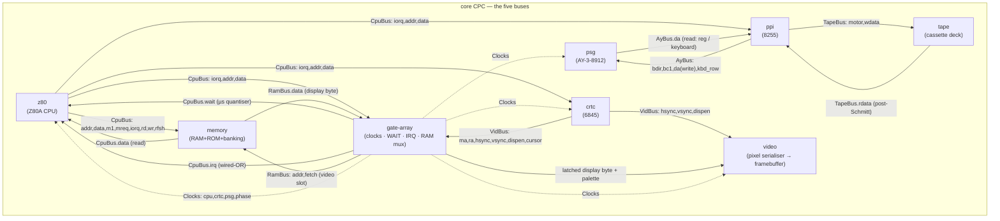
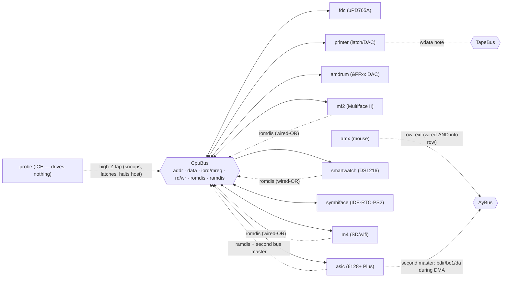
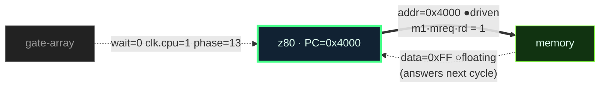
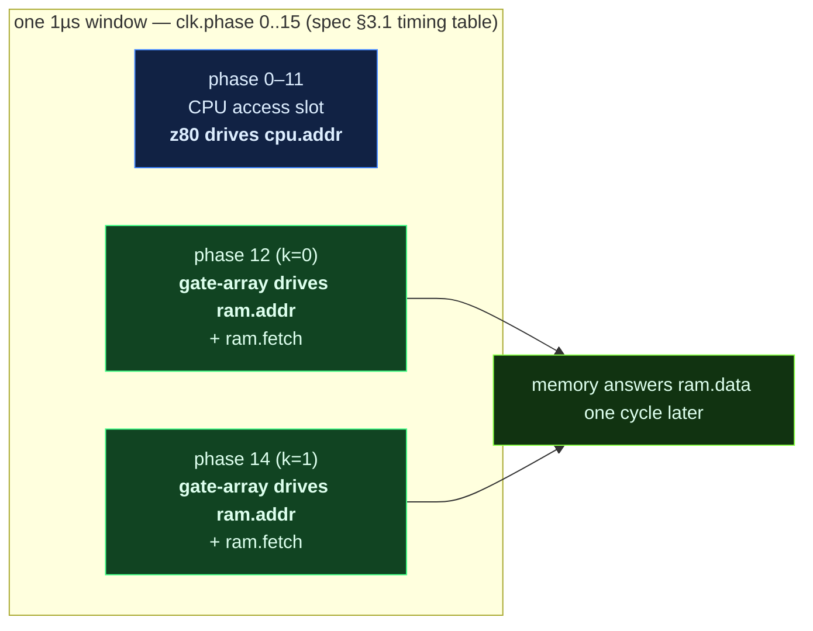
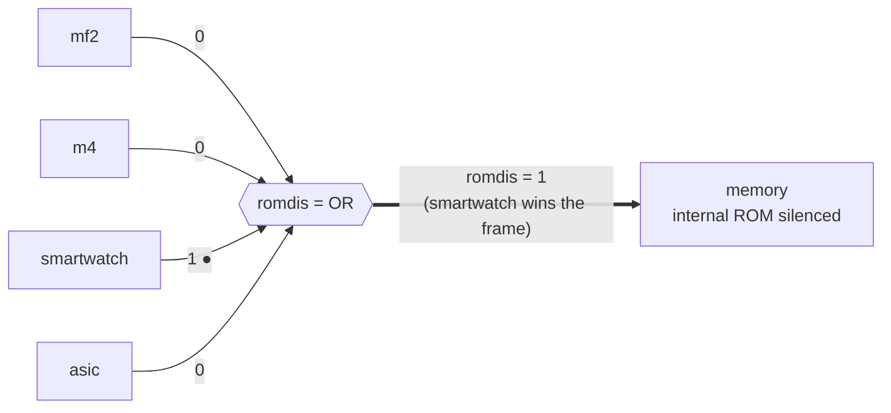
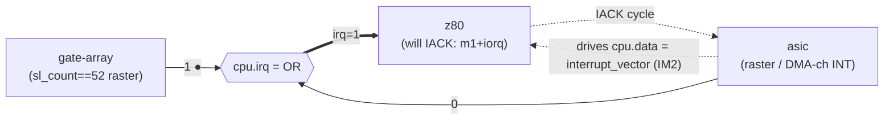
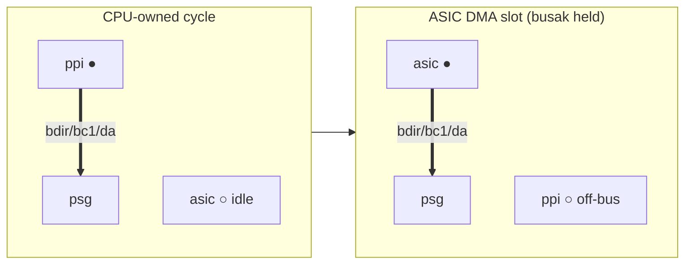
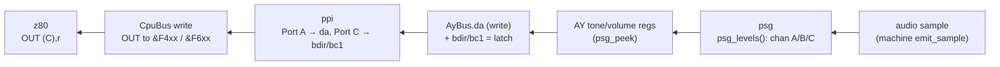

# The Live Motherboard — a dataflow / signal-provenance view

*A design proposal, not an implementation. Grounded in `src/hw/buses.h`,
`src/hw/board.h`, `src/hw/device.h`, and the real device roster assembled in
`src/subcycle/machine.cpp`.*

---

## 1. What a register table throws away

Open any classic CPC debugger and you get three flat lists: registers, a hex
dump, a disassembly. Each is a *photograph of one chip's internal memory*. None
of them tells you the thing that actually defines a CPC: it is **eighteen chips
shouting at each other across five wires, one master cycle at a time**, and every
byte you can see arrived because *some specific chip drove it onto a specific bus
line and some other chip latched it*.

konCePCja holds exactly that truth and normally hides it. The `Board` threads one
`Bus` value through every `Device` each 16 MHz master cycle (`board_tick`,
`src/hw/board.h:43`); the two-phase commit (§2) means at any instant we know, per
line, **who drove it** and **what value they drove**. That is a live wiring
diagram waiting to be drawn.

This document proposes drawing it: the motherboard as a **directed dataflow
graph** whose nodes are the real Devices, whose edges are the real bus lines, and
whose annotations update every master cycle with **direction** (who is driving vs
who is floating) and **value**. On top of that graph sits a **provenance / data
lineage** view: pick any displayed byte — a pixel, a sound sample, a register —
and walk backwards along the edges that carried it, hop by hop, chip by chip,
because the project's doctrine is that *every displayed byte travelled over the
bus* (no back-channels).

What this makes legible that a register view cannot:

- **The machine as a system.** Chips as nodes, buses as edges — the CPC's actual
  topology, not eighteen disconnected memory dumps.
- **Direction and drivership.** Who owns `cpu.addr` *this* cycle — the Z80, or
  the Gate Array doing a video fetch? A flat view can't even ask.
- **Contention.** Two drivers on one tri-state line is a hardware fault; a
  dataflow graph shows it as a red edge the instant it happens.
- **Provenance.** *Why* is this pixel cyan? Trace it: video ← `RamBus` ← memory ←
  (`MA`/`RA` from CRTC). The answer is a path, and the path is the explanation.
- **Isolation.** Every Device only reads `in` and writes its own lines of `out`
  (`device.h`). The graph is literally the set of edges each node is allowed to
  touch — the isolation contract, made visual.

---

## 2. The model: nodes are Devices, edges are bus lines

### 2.1 The two-phase commit is what makes "who drives this" answerable

Every master cycle, `board_tick`:

1. Starts a fresh `next` bus in the **resting/floating** state (`bus_resting()`:
   `data`/`da` pulled up to `0xFF`, every control line deasserted).
2. Ticks each Device: it reads **only** the committed `in` bus and writes **only
   the lines it drives** into `next` (`device.h:6-14`).
3. Commits `next` as the new bus.

Three rules from `device.h` give us everything the visual needs:

| Line class | Write discipline | Graph meaning |
|---|---|---|
| **owned / tri-state** (`addr`, `data`, `ma`, `hsync`, `da`, …) | **ASSIGN** — exactly one driver per cycle | a *directed edge*, one source node |
| **wired-OR** (`irq`, `romdis`, `ramdis`) | **OR-in** (`out->cpu.irq \|= mine`) | a *fan-in edge*, many possible sources |
| **input-only** | never written (probe drives nothing) | a *sink* / high-impedance tap |

Because the resting state is known and each owned line has exactly one legit
driver, **"who drives line L this cycle" is decidable**: it is the single Device
whose tick moved L away from resting. If two moved it, that is **contention** —
a fault the model can surface rather than silently last-writer-wins.

### 2.2 Deriving drivership without changing device code

The capture layer (§6) re-runs the same tick loop but with one instrumented
difference: before each Device ticks, snapshot `next`; after, diff it. Any line
that changed is *attributed to that Device*. Formally, per line `L`:

```
driver(L)   = the Device whose tick transitioned L from its resting value
contention  = |{ devices that transitioned L }| > 1
floating(L) = L still at resting value after all ticks (nobody drove it)
```

For wired-OR lines the "driver" is a **set** (every Device that OR-ed in a 1),
which is exactly what we want to visualise (§5).

---

## 3. The motherboard graph (real roster, real buses)

The nodes below are the exact Devices `board_add`ed in `machine.cpp:35-52`, using
their real `Device.name` strings. The edges are the exact `Bus` sub-structs and
fields from `buses.h`. Board order is irrelevant to results (`board.h`), so the
layout is chosen for readability, not execution order.

### 3.1 The whole board, grouped by bus



Read the edges as *signal flow*, and the arrowheads as *who latches*. Solid edges
are data/control on a physical bus; dotted edges are the clock-enable fabric the
Gate Array publishes (`Clocks` in `buses.h:100`) that every sub-16-MHz Device
gates on.

### 3.2 Expansions hang off `CpuBus` (and a few off `AyBus`/`TapeBus`)

The remaining Devices from `machine.cpp:43-52` are peripherals. They mostly
**snoop and drive `CpuBus`** (the "uncontested" I/O decodes), with a couple
tapping the internal buses. `probe` is bench equipment — it *drives nothing*
(`probe.h`: "infinite input impedance"), so it appears as a pure sink.



This second graph is deliberately drawn as *devices around a bus rail* to
emphasise the shared-medium reality: everything on `CpuBus` sees every I/O cycle;
who *responds* depends on the address decode inside each Device's tick.

### 3.3 The live overlay — one cycle, annotated

The graph above is static topology. The **live** view colours and labels each
edge from the per-cycle capture (§6). A single master cycle looks like this
(illustrative — a CPU opcode-fetch cycle at phase 13, the CPU's slot):



Legend for the live overlay:

- **● driven** (thick, bright edge): a device asserted this line in `next`;
  label shows the value and the driving node glows.
- **○ floating** (thin, dim edge): line at its resting value; nobody drove it.
- **Node tint**: *driver* (green), *responder-scheduled-next* (olive), *idle*
  (grey). Because signals propagate **one hop per master cycle** (spec §2), the
  responder lights up on the *following* frame of the animation — the one-cycle
  bus latency becomes a visible pulse travelling along the edge.

Scrub the master-cycle timeline and you watch the address leave the Z80, the
memory node light up a cycle later, and the data edge fill in the cycle after
that — the CPC's 62.5 ns handshake made watchable.

---

## 4. The interleave the graph exposes: `cpu.addr` has two owners

The single most CPC-defining fact a flat view hides: **`cpu.addr` / `cpu.data`
are time-division-multiplexed between the Z80 and the Gate Array's video fetch**
(`buses.h:55-62`, spec §3.1). Within each 1 µs (16 master cycles) window:



The dataflow view makes the **ownership handoff** its central animation: the
`cpu.addr`/`ram.addr` edge's source node *switches* between `z80` and `gate-array`
as `clk.phase` sweeps 0→15. This is precisely the thing "one register table per
chip" can never show — it is a property of the *edge*, not of any node. The RAM
mux (the two 74LS153s on the real board, modelled as the memory Device answering
whichever port is active) is the hidden third party; the graph draws it as the
`memory` node with two incoming address edges, only one live per cycle.

---

## 5. Wired-OR lines and the second bus master

Three `CpuBus` lines are **wired-OR** (`device.h`, `buses.h:36,41,42`): `irq`,
`romdis`, `ramdis`. Their driver is a *set*, and the visual must show fan-in, not
a single arrow.

### 5.1 `romdis` / `ramdis` — expansion overlays

`romdis` silences the internal ROM; `ramdis` silences internal RAM. Any expansion
can pull them high, and the effect is the OR of all of them. Draw them as an
explicit OR gate node fed by every potential asserter, with live/dim inputs:



Now a question a register view can't answer — *"why did the internal ROM go
quiet?"* — is a glance: the OR node shows **smartwatch** is the sole hot input
this cycle. If two inputs were hot, both light; that is legal for wired-OR (no
contention), unlike a tri-state line.

### 5.2 `cpu.irq` — the interrupt fan-in

The Gate Array's raster counter drives `cpu.irq` (`gate-array-device.md:26`); the
ASIC's programmable raster + DMA-channel interrupts also OR in
(`asic-device.md:26`). The provenance view answers *"who interrupted the CPU?"*:



The IACK back-edge (ASIC drives `cpu.data` with its IM2 vector during the
`m1`+`iorq` acknowledge, `asic-device.md:145`) is itself a provenance link: the
vector the Z80 fetches has a *source node*, which the trace names.

### 5.3 The second master — ASIC DMA on `CpuBus` and `AyBus`

The subtlest thing the model holds: during Plus DMA sound, the **ASIC becomes a
second bus master**. It raises `cpu.busrq`, takes `cpu.busak`, performs RAM reads
as master on `CpuBus`, and drives the PSG over `AyBus` (`bdir`/`bc1`/`da`) in its
scheduled slot — the same lines the PPI normally owns (`asic-device.md:24-38`,
129-131). Board-safe *only because the two never drive in the same cycle*.

The dataflow view makes this legible by **showing the driver of `AyBus.da` /
`bdir` switch from `ppi` to `asic`** exactly during DMA slots, mirroring the
`cpu.addr` handoff of §4:



If the two ever *did* drive `da` in one cycle, the contention detector (§2.2)
flags it red — turning "a real bus master hidden from the pin-level truth" (the
explicit anti-goal in `asic-device.md:38`) into a visible, testable invariant.

---

## 6. Capture — staying truthful to the pins

The whole view is driven by a **per-master-cycle snapshot** that must not invent
anything the wires don't carry. Two truth sources already exist:

1. **The committed `Bus`.** After `board_tick`, `board_.bus` *is* the pin state:
   every `addr`/`data`/`ma`/`da`/control line at its committed value. `machine.cpp`
   already reads it directly (e.g. `board_.bus.tape.rdata` in
   `capture_tape_output`, `machine.cpp:170`). The dataflow overlay reads the same
   struct — no new source of truth.

2. **Per-device `peek` surfaces.** Every Device exposes a read-only logical-state
   view: `z80_peek`, `ga_peek`, `crtc_peek`, `ppi_peek`, `psg_peek`, `mem_peek`,
   `video_peek`, `asic_peek`, `fdc_peek`, … (all in `src/hw/*.h`). These name the
   *internal* register a driven value came from (e.g. which CRTC register produced
   `ma`), which is what turns a bare edge value into a provenance label.

### 6.1 The drivership snapshot

Drivership (§2.2) needs one extra thing the plain committed bus doesn't retain:
*which Device* moved each line. The capture layer wraps the tick loop:

```
for each device d:
    before = next                     # copy of the in-progress bus
    d.tick(d.self, &committed, &next)  # normal tick, unchanged
    attribute(diff(before, next)) = d  # every changed line → d
detect_contention()                    # >1 attributed driver on a tri-state line
```

This is **non-invasive**: device ticks are untouched (isolation preserved), the
wrapper only observes. It runs in a capture/debug build or a single stepped
cycle, not the hot path. The output per cycle is a compact record:

```
CycleFrame {
  uint64 master_cycle;  uint8 phase;
  BusImage bus;                     // the committed Bus (all lines/values)
  DriverMap drivers;                // line → driving Device (or set, wired-OR)
  bool contention[…];               // per-tri-state-line fault flags
  // peek deltas: which internal reg each driver sourced its value from
}
```

A ring buffer of `CycleFrame`s (say the last 1 µs..1 frame) backs both the live
overlay and the provenance walk. This is the natural companion to the existing
`probe` Device (`probe.h`): the probe decides *when* to stop (breakpoint /
watchpoint latch); the dataflow ring captures *what the board looked like* around
that stop. The probe already records `{kind, addr, data, cycle}` at the matching
edge — the dataflow frame at `probe_hit.cycle` is the picture behind the trigger.

### 6.2 DevTools integration

This slots beside the existing DevTools windows (registers, disassembly, memory,
…) as a **"Motherboard"** window:

- **Live mode**: while running, render §3.1's graph with §3.3's overlay,
  refreshed at the framebuffer rate from the *latest* `CycleFrame` (or a 1 µs
  aggregate: "who drove `cpu.addr` most of this µs").
- **Scrub mode**: on pause / breakpoint, a master-cycle scrubber walks the ring;
  the graph re-renders per cycle, so you watch the address handoff of §4 and the
  IRQ fan-in of §5 frame by frame.
- **Cross-links**: clicking a node opens that Device's existing peek panel;
  clicking an edge value opens the provenance walk (§7) rooted at that byte. This
  reuses the `navigate_to(addr, NavTarget)` address-bus navigation already in
  DevTools.

Truthfulness bar: the overlay may render **only** what a `CycleFrame` contains —
committed bus values + peek-sourced register names + attributed drivers. If a
number can't be traced to a driven line or a peek surface, it doesn't appear.
That is the same doctrine as the rest of the project: *no back-channels*.

---

## 7. Signal provenance — walking a byte home

The payoff. Because every displayed byte travelled the bus, any byte has a
**lineage**: a path through (Device, bus-line, cycle) triples back to its origin.
The provenance view is a backward walk over the `CycleFrame` ring: given a target
line+value at cycle *t*, find the Device that drove it, ask *its* peek surface
what internal state produced it, then recurse on the inputs *that* Device read
(which are lines driven at cycle *t−1*, one hop back — spec §2).

### 7.1 Worked trace — "why is this pixel cyan?"

A pixel on screen is the end of a chain that starts at the CRTC's address
counter. Following `machine.cpp`'s real wiring (`video_attach(&vdev_, &gdev_, …)`,
so `video` reads latched pixels from `gate-array`; the RAM fetch path of
`buses.h:55-67`):

```mermaid
flowchart RL
  pixel["PIXEL @ (x,y)<br/>= cyan (pen 2)"]
  video["video<br/>serialises latched byte<br/>through GA palette"]
  ga_lat["gate-array<br/>latched display byte<br/>+ pen→palette"]
  ram["RamBus.data<br/>= display byte 0x0F"]
  mem["memory<br/>drove ram.data<br/>from RAM[addr]"]
  ram_addr["RamBus.addr + fetch<br/>= 0x1E2C"]
  ga_mux["gate-array<br/>vid_byte_addr(MA,RA,k)"]
  vid["VidBus.ma / vid.ra<br/>MA=0x0C3, RA=2"]
  crtc["crtc<br/>R12/R13 start + counters"]

  pixel --> video --> ga_lat --> ram --> mem --> ram_addr --> ga_mux --> vid --> crtc
```



Each hop is a concrete, capturable fact:

| Hop | Line (cycle) | Driver | Peek source of the value |
|---|---|---|---|
| pixel → video | framebuffer write | `video` | `video_peek`: mode, pen index |
| video → GA | latched byte + palette | `gate-array` | `ga_peek`: pen/ink palette regs |
| GA ← RAM | `ram.data` (t) | `memory` | `mem_peek`: bank config, RAM[addr] |
| RAM ← GA | `ram.addr`,`ram.fetch` (t−1) | `gate-array` | `ga_peek`: MA/RA shuffle, phase |
| GA ← CRTC | `vid.ma`,`vid.ra` (t−2) | `crtc` | `crtc_peek`: R1/R6/R12/R13 + counters |

The trace *names names*: "cyan because pen 2 = ink `0x0F`, from RAM byte at
`0x1E2C`, whose address is `MA=0x0C3,RA=2` from CRTC start-address R12/R13." No
register table can produce that sentence, because the sentence *is the path*.

### 7.2 Worked trace — "where did this sound sample come from?"

A stereo sample pushed by `accumulate_audio` (`machine.cpp:198`) traces back
through the PSG's channel levels to whoever last wrote the AY register — over
`AyBus`, driven by the PPI, written by the Z80:



And the *keyboard* half of the same PSG read path is a second provenance branch,
because the AY's Port A doubles as the keyboard/joystick read: `psg` reads
`ay.kbd_row` (which row the PPI selected) wired-ANDed with `ay.row_ext` (connector
pull-downs — the AMX mouse's `amx` Device pulls bits low, `buses.h:81-85`). So
"why did this key read as pressed?" traces PSG ← `AyBus.row_ext` ← `amx`/keyboard
matrix ← `ay.kbd_row` from PPI. Same machinery, different root.

### 7.3 Why provenance needs the ring, not just the current bus

Provenance is inherently **temporal**: hop *n* reads lines driven at cycle *t−n*
(one hop per master cycle, spec §2). A single committed `Bus` gives you the
pixel's *value*; only the `CycleFrame` ring gives you its *history*. This is why
capture (§6) stores a window of frames, and why the probe's `cycle` field
(`probe.h`) is the anchor a trace starts from.

---

## 8. What this reveals that a flat register view cannot

| Question | Flat register/hex/disasm view | Motherboard dataflow view |
|---|---|---|
| Who drives `cpu.addr` right now? | unanswerable | the live source node of the edge (z80 vs gate-array, per phase) |
| Why did internal ROM go silent? | unanswerable | the hot input of the `romdis` OR node (§5.1) |
| Who interrupted the CPU? | see `IFF`/`PC` after the fact | the hot input of the `cpu.irq` OR node (§5.2) |
| Is anything fighting over a bus line? | invisible (last-writer-wins) | contention = red edge, per tri-state line (§2.2) |
| Why is this pixel this colour? | infer by hand from CRTC+GA+RAM regs | a named path CRTC→GA→RAM→GA→video (§7.1) |
| Where did this sample come from? | infer from AY regs | a named path z80→PPI→AY→psg (§7.2) |
| Is the ASIC really a second master? | invisible | `AyBus`/`CpuBus` driver switches to `asic` during DMA (§5.3) |
| What is each chip *allowed* to touch? | not represented | the edge set each node may write — the isolation contract drawn (§2.1) |

The through-line: a register table shows **state**; the motherboard dataflow view
shows **relationships and causation** — the machine as a system of communicating,
isolated chips, with every value carrying a traceable pedigree. That is the truth
konCePCja's pin-level model already holds, finally drawn the way the hardware is
actually built.

---

## 9. Open questions

- **µs-aggregation vs per-cycle in live mode.** At 16 MHz the per-cycle overlay
  is too fast to read while running; the live view likely shows a 1 µs *summary*
  (dominant driver per line) and reserves per-cycle scrubbing for pause. What is
  the right summary for a line that legitimately changes owner mid-µs (§4)?
- **Wired-OR "winner" semantics.** For `romdis`/`irq` the result is the OR; the
  visual shows all hot inputs, but is there value in ranking them (which asserter
  is "responsible")? Probably not — OR has no winner — but users may expect one.
- **Provenance across `snapshot load`.** A loaded state has no bus history; a
  trace rooted before the load can't cross it. Frames should be tagged with an
  epoch so the walk stops cleanly at a load boundary rather than lying.
- **Cost.** The drivership wrapper (§6.1) doubles bus copies per device per cycle.
  Fine for a debug/step build; needs measuring before it runs live at frame rate.
