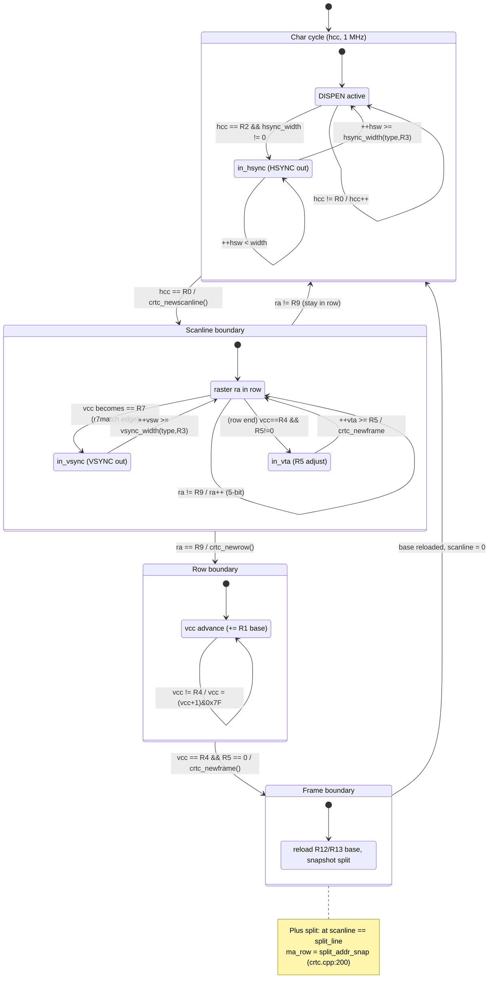
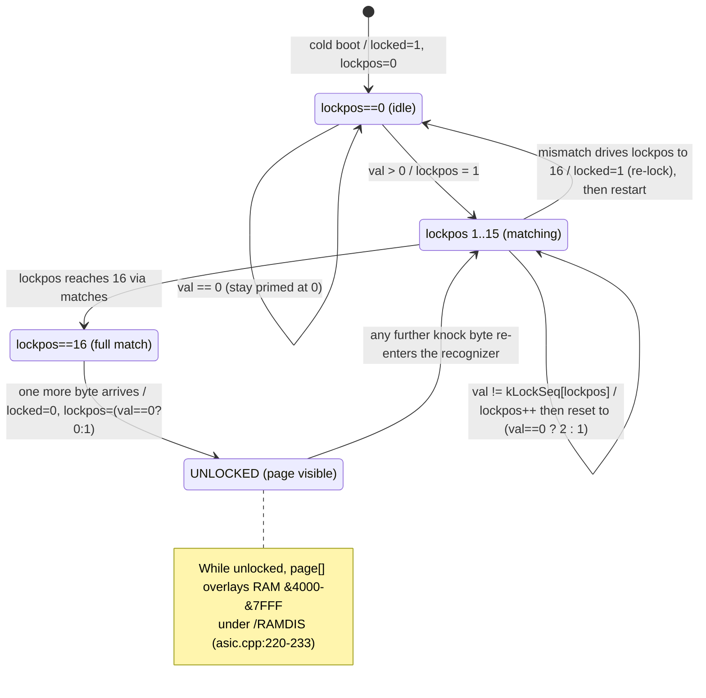
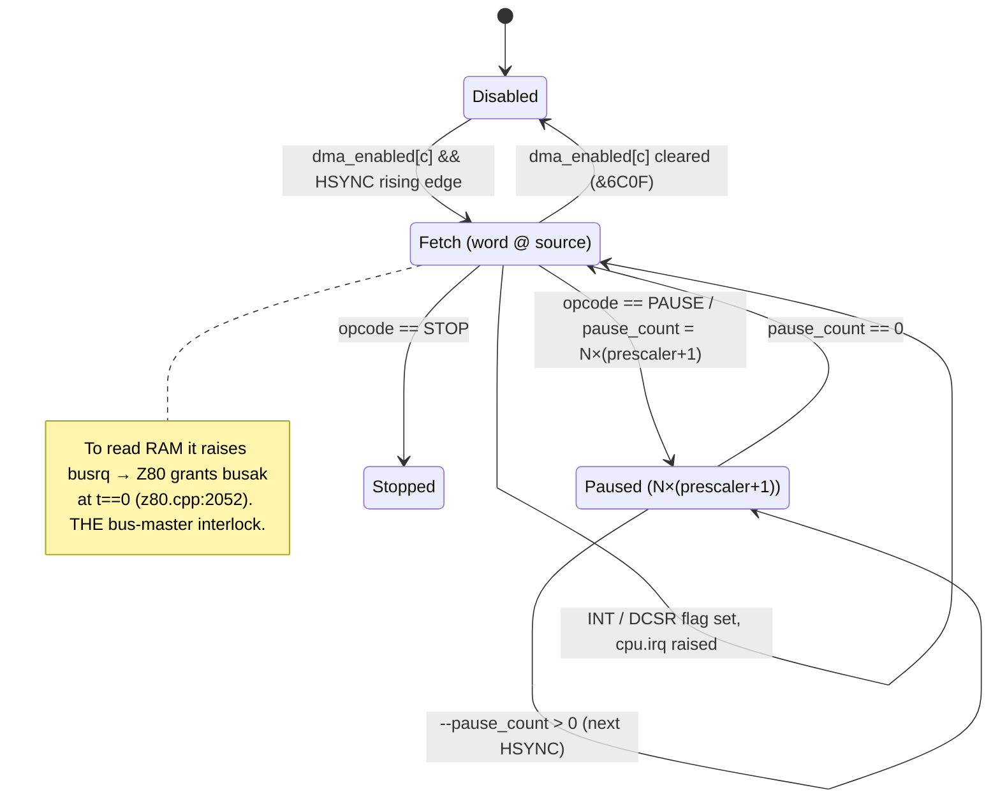
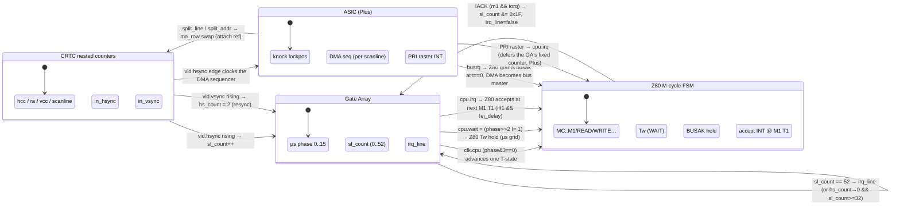
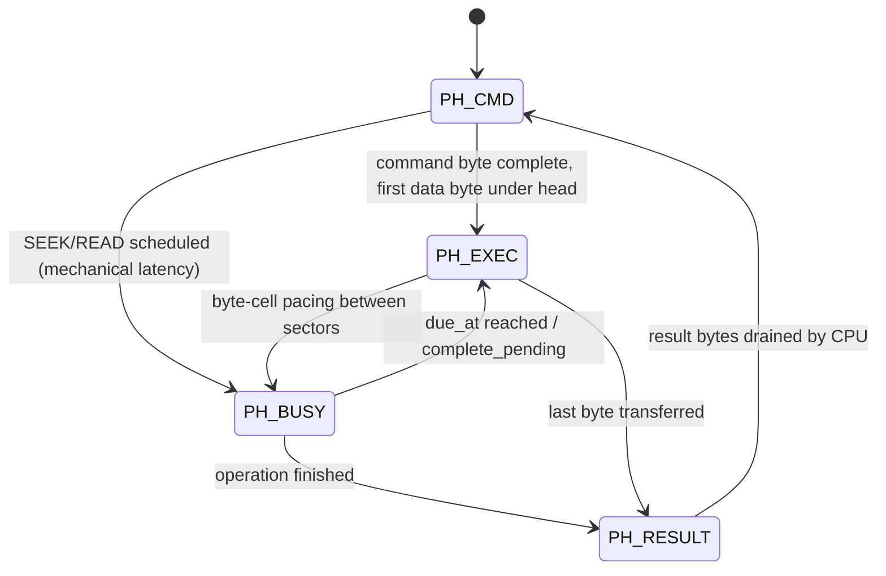

# The State-Machine Atlas — the CPC as a living nest of FSMs

> **Status:** design / vision. No code here. A proposal for a new DevTools
> representation, grounded line-by-line in the real `src/hw/` Devices.

## 1. The thesis

konCePCja's Devices are not "emulation of" finite state machines — several of
them *are* finite state machines, written as such. The Z80 carries an explicit
machine-cycle enum (`z80_state::MC`), the CRTC is four nested counters walking
`crtc_char → crtc_newscanline → crtc_newrow → crtc_newframe`, the Plus ASIC
guards its register page behind a 17-byte "knock" recognizer (`feed_knock`), the
tape deck is a `PH_PILOT → PH_SYNC1 → PH_SYNC2 → PH_DATA → PH_PAUSE` pipeline,
and the µPD765 floppy controller cycles `PH_CMD → PH_EXEC → PH_RESULT → PH_BUSY`.

A register table shows you *values*. It cannot show you that the Z80 is in
`MC::WRITE` T-state 2 of the second of two bus cycles, held by the Gate Array's
`/WAIT` because `clk.phase != 0`, about to be pre-empted at the next M-cycle
boundary by the ASIC's DMA sound sequencer asserting `busrq`. That is the truth
the machine holds, and it is *shaped like a state diagram*. The Atlas draws it.

**The Atlas** is a zoomable set of live state-diagram views — one per chip FSM —
where at every pause the CURRENT state is highlighted, the LAST transition that
fired is shown fading, and the NEXT transition is annotated with the guard
condition that will (or won't) let it fire. It is driven entirely from the
Devices' existing `*_peek()` surfaces plus a handful of proposed additions.

---

## 2. A unified visual language

Every FSM in the Atlas is drawn with the same vocabulary so that a CRTC diagram
and a Z80 diagram read the same way:

| Glyph / style | Meaning | Sourced from |
|---|---|---|
| **Bold-filled node** | the state the FSM is in *right now* | the peek field naming the state (`mc`, `phase`, `in_hsync`…) |
| Dashed halo on a node | the state it was in on the *previous* pause/step | Atlas keeps the prior peek snapshot |
| **Green edge** | the transition that fired since the last snapshot | diff of two peek snapshots |
| **Amber edge** | the transition *armed* to fire next, guard currently TRUE | evaluate the guard against live peek + bus |
| Grey edge | a transition whose guard is currently FALSE | as above |
| Edge label `cond / action` | the real guard and side effect | quoted from the source line |
| Small chip badge on a node | this state is *interlocked* to another FSM | see §7 |

Node names are the **real enum/counter names**, never prettified: `MC::M1`,
`PH_BUSY`, `in_vsync`, `lockpos==16`. The label under each edge is the actual C
condition (e.g. `hcc == R0`, `vcc == R7`, `val == kLockSeq[lockpos]`) so a
developer can grep the label straight back to the line that owns it.

Three zoom levels:

- **Atlas (L0):** every chip as one collapsed node showing only its top-level
  state name and a "distance to next transition" gauge.
- **Chip (L1):** one Device's full state diagram (the mermaid diagrams below).
- **Cycle (L2):** the sub-state ladder — the Z80's T-state counter inside a
  machine cycle, the CRTC's hcc inside a scanline — as an odometer beside L1.

---

## 3. The Z80 M-cycle FSM

The engine is an explicit per-instruction M-cycle step machine. The state is
`z80_state::MC` (`src/hw/z80.cpp:61`):

```c
enum class MC : uint8_t { M1, READ, WRITE, INTERNAL, IO, IOACK };
```

with a T-state counter `t` inside each machine cycle (`z80.cpp:92`), a HALT
latch (`halted`, `halt_t`), an interrupt sub-sequence `Servicing { NONE, NMI,
MASKABLE }` (`z80.cpp:74`), and the DMA hold (`held.busak`). The tick function
(`z80_tick`, from `z80.cpp:2022`) shows the real control flow: HALT spin →
BUSRQ/BUSAK hold → GA µs-quantiser `/WAIT` → the `switch (z->mc)` dispatch.

```mermaid
stateDiagram-v2
    [*] --> M1 : reset (mc = MC::M1)

    state "MC::M1 (opcode fetch)" as M1
    state "MC::READ" as READ
    state "MC::WRITE" as WRITE
    state "MC::INTERNAL" as INTERNAL
    state "MC::IO" as IO
    state "MC::IOACK (int ack)" as IOACK
    state "HALT spin" as HALT
    state "BUSAK hold (DMA)" as BUSAK
    state "Tw (WAIT stretch)" as WAIT

    M1 --> M1 : t<final / bump t
    M1 --> READ : micro() requests operand read
    M1 --> WRITE : micro() requests store
    M1 --> INTERNAL : micro() requests dead cycle
    M1 --> IO : micro() requests IN/OUT
    M1 --> HALT : opcode 0x76 (HALT) — micro_x1 y==6,z==6

    READ --> M1 : instruction finished (finish())
    READ --> WRITE : next M-cycle
    READ --> READ : more operand bytes
    WRITE --> M1 : finish()
    INTERNAL --> M1 : finish()
    IO --> IOACK : Tw released (GA drops cpu.wait)
    IOACK --> M1 : servicing set, resume at M1

    HALT --> HALT : int_ready == false / halt_t++ ; every 4T bump_refresh
    HALT --> M1 : int_ready (NMI or iff1 && irq && !ei_delay) / pc++, mc=M1

    M1 --> BUSAK : t==0 && cpu.busrq / out.busak=true, held
    READ --> BUSAK : t==0 && cpu.busrq
    WRITE --> BUSAK : t==0 && cpu.busrq
    BUSAK --> M1 : cpu.busrq released / resume next M-cycle

    M1 --> WAIT : t==1 && mc is memory && clk.phase!=0 / consume Tw
    READ --> WAIT : t==1 && mc is memory && clk.phase!=0
    WRITE --> WAIT : t==1 && mc is memory && clk.phase!=0
    WAIT --> M1 : phase==0 reached (µs grid)
```

**Real guards, cited:**

- **HALT entry:** `micro_x1(y,z)` with `y==6 && z==6` (`z80.cpp:1706-1707`) — PC
  is held *at* the HALT opcode while halted.
- **HALT exit:** `int_ready = nmi_pending || (iff1 && irq && !ei_delay)`
  (`z80.cpp:2022-2032`); on wake `pc++`, `mc = MC::M1`, `t = 0`.
- **BUSRQ/BUSAK hold:** only at a machine-cycle boundary `t == 0`
  (`z80.cpp:2052`); grants `out.busak`, sets `held.busak`, advances *no*
  T-state until `busrq` deasserts. This is the seam where the Plus ASIC sound
  DMA becomes bus master (§7).
- **The GA µs-quantiser Tw:** `t == 1 && mc != INTERNAL && mc != IO &&
  in->clk.phase != 0` consumes a wait T-state (`z80.cpp:2082-2089`). Memory
  M-cycles can only start their T1 on the 1 µs grid; `INTERNAL` and `IO` are
  exempt (IO stretches later, in its own Tw honouring `cpu.wait`). This is the
  interlock that makes PUSH = 16T, `LD HL,(nn)` = 20T fall out naturally.

**Peek surface & the gap.** Today `z80_peek()` fills `Z80Regs` with architectural
registers plus `tstates`, `halted`, `im` (`z80.h:19-30`). It does **not** expose
`mc`, `t`, or `servicing` — so the Atlas cannot yet highlight the current node.
The doc's ask (see §8): add `mc`, `t`, `servicing`, `held.busak` to `Z80Regs` (or
a sibling `Z80Micro` peek). They already exist as fields on `z80_state`; only the
peek copy is missing.

---

## 4. The CRTC nested frame → row → scanline → char machine

The CRTC is the Atlas's showpiece because it is genuinely *nested* — four
counters, each the "clock" for the one above it. The call chain is literally the
nesting (`src/hw/crtc.cpp`):

- `crtc_char()` (`crtc.cpp:204`) — one 1 MHz character; advances `hcc` (8-bit,
  wraps at 256), fires HSYNC at `hcc == R2`, DISPEN window, and at `hcc == R0`
  calls…
- `crtc_newscanline()` (`crtc.cpp:166`) — advances `scanline`; runs VSYNC width,
  VTA; at `ra == R9` calls…
- `crtc_newrow()` (`crtc.cpp:149`) — advances `vcc` (7-bit); at `vcc == R4` ends
  the vertical total, and either enters VTA (if `R5 != 0`) or calls…
- `crtc_newframe()` (`crtc.cpp:136`) — resets `vcc/ra/scanline`, reloads the base
  address from R12/R13, snapshots the Plus split, re-checks VSYNC.



**Real guards, cited:**

- **HSYNC start:** `hcc == R2 && hsync_width(c) != 0` (`crtc.cpp:206`). Width 0
  on types 0/1 means *no HSYNC at all* — and therefore no GA raster interrupts.
  The Atlas draws that edge permanently grey on those types, which explains a
  dead-interrupt bug at a glance.
- **VSYNC start (edge-detected):** `check_vsync_start()` fires only when
  `vcc == R7` *becomes* true (`r7match` latch, `crtc.cpp:113-120`) — never
  retriggers while a VSYNC runs. The amber "next" edge here is a true edge
  detector, not a level.
- **Row end / VTA fork:** `vcc == R4`; if `R5 != 0` go to VTA else new frame
  (`crtc.cpp:152-160`).
- **Plus split:** `plus_split && scanline == split_sl_snap` swaps `ma_row` to
  `split_addr_snap` (`crtc.cpp:172, 200`) — the ASIC-fed nesting (§7).

**Peek surface.** `crtc_peek()` already exposes everything the Atlas needs:
`hcc, ra, vcc, ma, hsync, vsync, dispen, reg_select, type, scanline, reg[18]`
(`CrtcRegs`, `crtc.h:21-34`). The `in_vta` flag is the only one not peeked; add
it so the VTA node can highlight.

---

## 5. The ASIC unlock "knock" FSM

The Plus register page is hidden until a program writes a 17-byte magic sequence
to the CRTC register-select port. The recognizer is `feed_knock()`
(`src/hw/asic.cpp:59-77`), stepping `lockpos` through `kLockSeq[16]`
(`asic.cpp:15-18`). It is a classic "combination-lock" FSM with a subtle
mismatch-recovery rule.



**Real guards, cited:**

- **Prime:** at `lockpos == 0`, only a non-zero byte advances to 1
  (`asic.cpp:60-62`) — the two leading `0x00` in `kLockSeq` are matched *after*
  priming, exactly as the hardware expects (comment at `asic.cpp:56-58`).
- **Match:** `val == kLockSeq[lockpos] → lockpos++` (`asic.cpp:65-66`).
- **Mismatch recovery:** `lockpos++`; if that reaches `kLockLen` the sequence was
  "all-but-last", so `locked = 1` (re-lock); then `lockpos = (val==0)?2:1`
  (`asic.cpp:67-71`). This dual restart is exactly the sort of behaviour a value
  table hides and a state diagram makes obvious.
- **Unlock:** at full match, the *next* byte sets `locked = 0`
  (`asic.cpp:74-76`).

**Peek surface & the gap.** `asic_peek()` exposes `locked` and `plugged`
(`AsicRegs`, `asic.h:26-36`) — enough to highlight Locked vs Unlocked, but
**not** `lockpos`, so the Atlas can't show *how far into the knock* a loader has
gotten. Add `lockpos` (and the DMA channel `paused`/`loop_count`, §6) to
`AsicRegs`. This turns "why is my Plus demo not unlocking?" into a live gauge:
watch `lockpos` climb and snap back to 1 on the byte that broke the sequence.

---

## 6. The ASIC DMA sound sequencer (a program *is* the FSM)

Beyond the knock, the ASIC hosts three tiny 16-bit-instruction sequencers, one
per sound-DMA channel, clocked **once per scanline off the HSYNC leading edge**
(`asic_dma_cycle`, spec `docs/hardware/asic-device.md §4`). Each channel is its
own program counter walking an opcode stream in RAM:

- `LOAD R,DD` — write PSG register R
- `PAUSE N` — wait `N × (prescaler+1)` scanlines
- `REPEAT NNN` / `LOOP` — loop-count set / branch to loop address
- `INT` — raise the channel's interrupt (sets DCSR flag, drives `cpu.irq`)
- `STOP` — halt the channel
- `NOP` — (the last four are OR-combinable in one word)



The decoded per-channel registers already parse in `decode_dma()`
(`asic.cpp:169-191`): `dma_source[3]`, `dma_prescaler[3]`, `dma_enabled[3]`,
surfaced by `asic_dma_regs()` (`asic.cpp:329`). The sequencer's *live* PC,
pause counter, and loop counter are the increment-C state the Atlas wants
peeked.

---

## 7. How the FSMs nest and interlock

The Atlas's most important view is the one no single chip diagram can show: the
**interlock graph**, where one FSM's output edge is another's guard. These are
not abstractions — each arrow is a real bus line in `src/hw/buses.h` or an
intra-chip attach reference.



**Each interlock, cited to the line:**

1. **GA clock → Z80 T-state.** `out->clk.cpu = (g->phase & 0x03) == 0`
   (`gate_array.cpp:63`). The Z80 advances exactly one T-state per master cycle
   where `clk.cpu` is enabled.
2. **GA `/WAIT` → Z80 µs alignment.** `out->cpu.wait = (g->phase >> 2) != 1`
   (`gate_array.cpp:73`); the Z80 honours it by holding memory-M-cycle T1 while
   `clk.phase != 0` (`z80.cpp:2082`). *The Z80's M-cycle FSM literally cannot
   leave T1 of a bus cycle except on the GA's µs grid.*
3. **CRTC HSYNC → GA line counter.** `hs_rise = in->vid.hsync && !hsync_prev`
   → `sl_count = (sl_count+1) & 0x3F`; `sl_count == 52` raises `irq_line`
   (`gate_array.cpp:92-105`). The CRTC's *scanline* transition is the GA
   interrupt counter's *clock*.
4. **CRTC VSYNC → GA resync.** `vs_rise → hs_count = 2`; two HSYNCs later, if
   `sl_count >= 32` force an INT and clear (`gate_array.cpp:99-110`).
5. **GA IRQ → Z80 accept.** `if (g->irq_line) out->cpu.irq = true`
   (`gate_array.cpp:129`); the Z80 accepts only at an M1 T1 instruction
   boundary with `iff1 && irq && !ei_delay` (`z80.cpp:2098, 2126`).
6. **Z80 IACK → GA counter reset.** on interrupt acknowledge the GA does
   `sl_count &= 0x1F` (`gate_array.cpp:120`) — the acknowledge feeds *back* into
   the counter FSM.
7. **ASIC DMA → Z80 bus.** the sequencer raises `busrq`; the Z80 grants `busak`
   at `t == 0` and holds (`z80.cpp:2046-2058`). The comment there names the
   master explicitly: "a DMA master — the Plus ASIC's sound sequencer".
8. **ASIC split → CRTC address.** `crtc_attach_asic` gives the CRTC an ASIC
   reference; `snapshot_split()` latches `split_line/split_addr` per frame
   (`crtc.cpp:124-134`), applied at `scanline == split_sl_snap`.

This is what the Atlas reveals that nothing else can: **the machine as a mesh of
clocks-for-each-other.** Pause on a scanline-timed raster split and you can watch
the CRTC's `hcc == R0` edge fire → `crtc_newscanline` → `vid.hsync` rise → GA
`sl_count++` → (at 52) `irq_line` → Z80 amber "accept at next M1" — a full causal
chain across four chips, lit up as connected edges.

---

## 8. Bonus FSMs the same language covers

**Tape deck** (`src/hw/tape.cpp:18`): `PH_IDLE → PH_PILOT → PH_SYNC1 → PH_SYNC2
→ PH_DATA → PH_PAUSE` (plus `PH_PULSESEQ` for block 0x13). Guard edges are the
pulse counters (`pulses_left`, `bit_idx`, `pause_cycles`); `phase` is already a
peekable field. A loading demo becomes a visible walk down the pipeline.

**µPD765 FDC** (`src/hw/fdc.cpp:21`): `PH_CMD → PH_EXEC → PH_RESULT`, with
`PH_BUSY` for mechanical latency. Transitions cited: command dispatch →
`PH_EXEC` when the byte is under the head (`fdc.cpp:515, 706`); seek/read
schedule → `PH_BUSY` (`fdc.cpp:391, 428, 609, 785`); completion → `PH_RESULT`
(`fdc.cpp:307`); result drained → `PH_CMD` (`fdc.cpp:315`). `FdcRegs.phase`,
`msr`, `st0/1/2` are already peeked (`fdc.h:26-36`), so the FDC diagram is
Atlas-ready today.



---

## 9. "Current state + about-to-transition": the peek contract

For each FSM the Atlas needs three things: (a) which peek field names the current
state, (b) the sub-counter for the L2 odometer, (c) the guard expression to
evaluate for the amber "next" edge. Summary of what exists vs. what to add:

| FSM | State field (exists?) | L2 counter | Guard to evaluate live | Peek gap to fill |
|---|---|---|---|---|
| Z80 M-cycle | `mc` (**missing from `Z80Regs`**) | `t` | `t==1 && mem && phase!=0`; `irq && iff1` | add `mc`, `t`, `servicing`, `held.busak` |
| CRTC | `hcc/ra/vcc/scanline/hsync/vsync/dispen` ✓ | `hcc` in scanline | `hcc==R0`, `ra==R9`, `vcc==R4/R7`, `hcc==R2` | add `in_vta` |
| ASIC knock | `locked` ✓ | `lockpos` (**missing**) | `val==kLockSeq[lockpos]` | add `lockpos` |
| ASIC DMA | `dma_enabled[c]` ✓ | seq PC / `pause_count` | `HSYNC edge && enabled`, opcode decode | add live PC, pause/loop counters |
| Gate Array | `sl_count/hs_count/irq/phase` ✓ | `sl_count` | `sl_count==52`, `hs_rise` | none |
| Tape | `phase` ✓ | `bit_idx/pulses_left` | pulse counters | expose via `TapeRegs` |
| FDC | `phase` ✓ | `msr` bits | `now>=due_at`, byte pacing | none |

**The "why did it transition" annotation.** Because every edge label is the
actual guard expression, the Atlas can, at each pause, evaluate it against the
two most recent peek snapshots and print the *reason*: not "VSYNC started" but
"`vcc == R7` (7) became true — r7match edge, `crtc.cpp:115`". A tiny "why" tag on
the green (just-fired) edge is literally the C condition that evaluated true, with
its source line. That is the single most valuable thing the Atlas adds over a
register table: it answers *why the next thing happens*, sourced from the code
that decides it.

Capture is cheap and non-invasive: the Atlas is a pure *reader*. It pulls
`z80_peek`, `crtc_peek`, `ga_peek`, `asic_peek`, `fdc_peek` (plus the proposed
field additions) once per pause/step, diffs against the prior snapshot to color
the fired edge, and evaluates the (small, fixed) guard set to arm the next edge.
No new bus lines, no hooks in the hot path — it reads the same introspection
surface the IPC `regs`/`devtools` commands already use.

---

## 10. Why this beats a register table

A register table is a **noun list**: PC=0x4000, sl_count=51, lockpos=15. The
Atlas is a **verb graph**: it shows that PC is mid-`MC::WRITE`, that `sl_count`
is one HSYNC away from firing the raster interrupt, that `lockpos` is one correct
byte from unlocking the Plus — and, critically, *what edge will carry each of
them to its next state and why*. The CPC is not a bag of registers that happen to
hold values; it is a lattice of finite state machines clocking one another. The
Atlas is the first view that draws it the way the silicon — and `src/hw/` —
actually organizes it: nested, interlocked, and always one guard away from its
next move.
